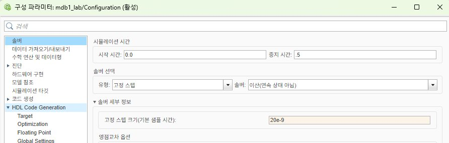
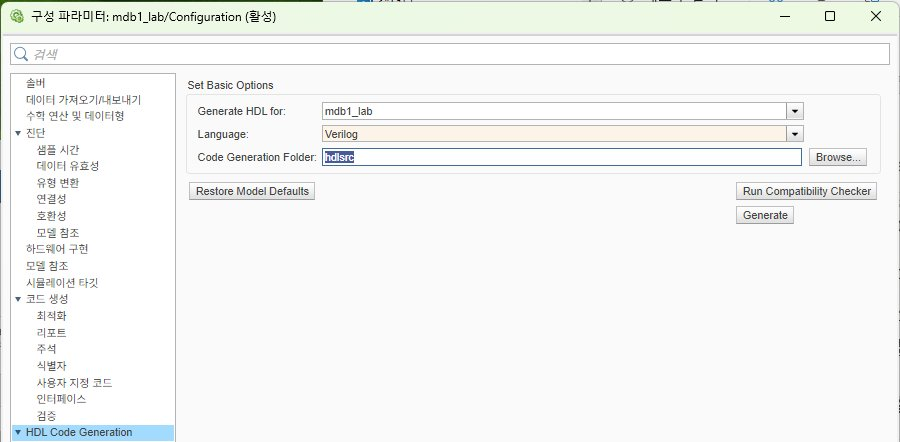
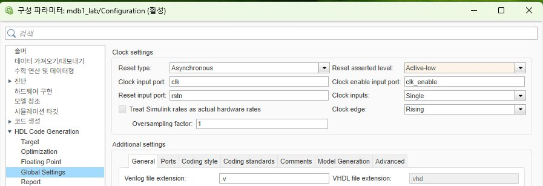
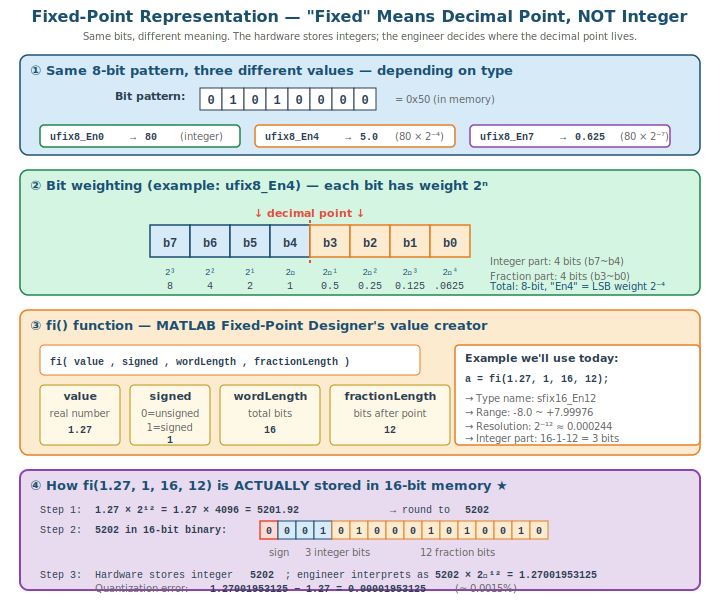
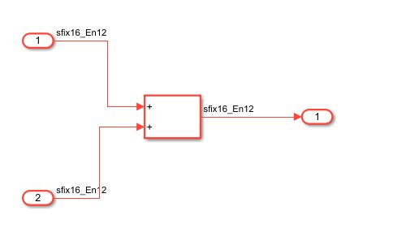
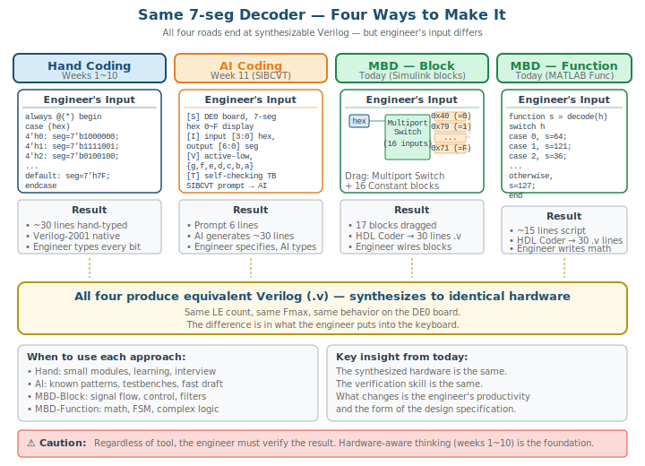

# Model-Based Design 1 — MBD 입문 + end-to-end 사이클 한 바퀴

> **본 강의 14주의 마지막 3회 중 첫 시간.** hand coding(1~10주)·AI 코딩(11주)에 이어 세 번째 도구인 MBD로 학기를 마감한다.
>
> - **MBD 1 (본 회):** MBD 입문, Fixed-point 표현, end-to-end 사이클 1회 수행
> - **MBD 2:** (다음 회, 별도 자료)
> - **MBD 3:** (다음 회, 별도 자료)

## 0. 사전 준비 — MATLAB Toolbox 설치 확인

MBD 1·2·3은 MATLAB/Simulink를 사용한다. 강의 전 각 노트북에 필요한 toolbox 설치 여부를 확인한다.

### 설치 확인 방법

MATLAB Command Window에서 다음을 실행한다.

```matlab
ver
```

출력 목록에서 아래 항목의 존재를 확인한다.

### 최소 필수 (4종)

미설치 시 강의 진행이 불가하다.

| Toolbox | 역할 |
|---|---|
| MATLAB | 기본 환경 |
| Simulink | 블록 다이어그램 모델링 |
| HDL Coder | Simulink → Verilog 자동 생성 |
| Fixed-Point Designer | float → fixed 변환, 비트폭 결정 |

### 권장 (2종)

미설치 시에도 진행은 가능하나 일부 데모가 제한된다.

| Toolbox | 역할 |
|---|---|
| Simulink Control Design | PID Tuner |
| Control System Toolbox | Transfer function, plant 모델링 |

### 환경 정보

- MATLAB 버전: R2025b
- 합성 도구: Quartus Prime 13 (Cyclone III/II 지원)
- 시뮬레이션: ModelSim Altera Starter Edition 10.1d
- 보드: DE0 (EP3C16F484C6) 또는 DE1 (EP2C20F484C7)

> NOTE: HDL Coder의 기본 옵션은 신형 합성 도구(Vivado, Quartus Pro) 기준이다. 본 강의는 Quartus 13을 사용하므로 일부 옵션의 수동 조정이 필요하다. 상세 내용은 섹션 7에서 다룬다.

---

## 1. 본 회 개요

### 학습 목표

- Model-Based Design(MBD)의 개념과 HLS·MBD 트렌드를 설명할 수 있다
- MATLAB/Simulink 기반 FPGA 설계의 5단계 워크플로우와 모델 설정(discrete·fixed-step, sample time)을 이해한다
- Fixed-point 표현이 필요한 이유와 `fi()` 표기, 양자화 오차를 이해한다
- HDL 변환 가능한 Simulink 블록의 주요 카테고리를 안다
- Simulink Block 방식과 MATLAB Function 방식의 차이를 알고, `persistent` 상태 변수 패턴을 이해한다
- HDL Code Generation의 핵심 설정(Target, Reset, Verilog 버전)과 변환 절차를 안다
- 모듈 1개를 두 방식으로 end-to-end 사이클(모델→시뮬→HDL 변환→ModelSim)을 1회 수행한다

### MBD 1의 범위

본 회는 시스템 설계를 다루지 않는다. MBD의 작업 흐름을 모듈 단위로 1회 수행하는 것이 목표다. 시스템 규모의 설계는 MBD 2·3에서 다룬다.

본 회의 작업 흐름은 다음과 같다.

- 모델 작성 → 시뮬레이션 검증 → HDL 자동 변환 → ModelSim 재검증

이 흐름은 hand coding과 동일한 결과(Verilog)를 산출한다. 차이는 코드를 직접 작성하는 대신 모델을 작성하고 자동 변환한다는 점이다.

---

## 2. MBD 소개 + HLS·MBD 트렌드

#### 2.1 두 가지 자동 변환 도구

hand coding 외에 Verilog를 만드는 두 가지 자동 변환 도구가 산업계 트렌드이다:

| 도구 | 입력 | 적합 영역 |
|---|---|---|
| **HLS** (High-Level Synthesis) | C / C++ | 알고리즘 가속기, 데이터 처리 |
| **MBD** (Model-Based Design) | Simulink 블록도 / MATLAB function | 제어, 통신, 신호 처리 |

**HLS 예시:** Vivado HLS, Catapult HLS — C 코드를 Verilog로 자동 변환
**MBD 예시:** MATLAB HDL Coder, dSPACE — Simulink 모델을 Verilog로 자동 변환

#### 2.2 본 강의는 MBD에 집중

본 강의의 학생은 제어로봇과이다. 제어·신호처리·통신은 **수학식이 명확한 영역** 이고, 이런 영역에서는 MBD가 HLS보다 자연스럽다. 알고리즘이 블록 다이어그램 형태로 사고하기 쉽다.

> TIP: HLS는 컴퓨터공학과·소프트웨어 출신이 더 친숙하다. MBD는 전자공학·제어공학 출신이 더 친숙하다. 본 강의는 MBD 방향.

#### 2.3 hand coding → AI → MBD 흐름

본 강의의 Verilog 생성 방법은 3단계로 전개되었다.

- 1~10주: hand coding — Verilog 직접 작성
- 11주: AI 코딩 — SIBCVT 프롬프트로 AI 생성
- MBD 1~3: MBD — Simulink 블록도 또는 MATLAB Function

세 방식 모두 동일한 결과(Verilog)를 산출하며, 각각 장단점이 다르다.

---

## 3. MATLAB/Simulink 기반 FPGA 설계 흐름

#### 3.1 5단계 워크플로우


1. **Algorithm modeling** — Simulink 또는 MATLAB function으로 알고리즘 표현
2. **Functional verification** — Simulink 시뮬레이션으로 동작 검증
3. **Fixed-point conversion** — 비트 폭 결정 (또는 처음부터 fixed-point로 작성)
4. **HDL generation** — Generate HDL로 Verilog 자동 생성
5. **HDL verification** — 생성된 HDL을 ModelSim에서 다시 검증

#### 3.2 필수 Toolbox

| Toolbox | 본 회 사용 |
|---|---|
| **MATLAB** | 기본 환경 |
| **Simulink** | 블록 다이어그램 작성 |
| **HDL Coder** | Simulink/MATLAB → Verilog 변환 |
| **Fixed-Point Designer** | 비트 폭 결정 + fixed-point 산술 |

자세한 사양은 본 문서 첫 섹션 "0. 사전 준비" 참조.

#### 3.3 모델 설정 — Solver와 Sample Time

HDL로 변환할 모델은 디지털 회로처럼 동작해야 한다. 이를 위해 모델 작성 전 Solver를 다음과 같이 설정한다.

| 설정 항목 | 값 | 이유 |
|---|---|---|
| 유형 (Type) | 고정 스텝 (Fixed-step) | 클럭처럼 일정 간격으로 동작 |
| 솔버 (Solver) | 이산 (연속 상태 아님) | 연속 시간 요소 없음 |
| 고정 스텝 크기 (sample time) | 클럭 주기 | 1 step = 1 클럭 |

**설정 절차:**

1. Simulink 모델 창에서 Configuration Parameters를 연다 (Ctrl+E).
2. 좌측 목록에서 **솔버** 항목을 선택한다.
3. **솔버 선택** 영역에서 유형을 `고정 스텝`, 솔버를 `이산(연속 상태 아님)`으로 설정한다.
4. **솔버 세부 정보** 영역의 `고정 스텝 크기(기본 샘플 시간)` 칸에 클럭 주기를 입력한다. 50MHz 회로이면 `20e-9`(= 20ns)를 입력한다.



핵심 개념은 sample time이 하드웨어의 클럭 주기에 대응한다는 점이다. 50MHz 클럭이면 sample time은 1/50MHz = 20ns이며, 칸에 `20e-9`를 입력한다. 시뮬레이션의 1 step이 실제 하드웨어의 1 클럭 사이클이 된다.

> NOTE: 고정 스텝 크기는 대상 하드웨어의 클럭 주파수에 맞춘다. DE0/DE1의 50MHz 클럭을 쓰면 `20e-9`이다.

> NOTE: 연속 시간(continuous) 모델이나 가변 스텝(variable-step) 설정은 HDL로 변환되지 않는다. HDL 대상 모델은 반드시 이산·고정 스텝이어야 한다. MBD 2의 DDS 모델도 이 설정에서 시작한다.

#### 3.4 HDL 출력 설정 — 미리 정해 둘 항목

Solver 설정이 "모델을 어떻게 동작시킬지"라면, HDL 출력 설정은 "어떤 Verilog를 생성할지"를 정한다. 본 강의는 구형 Quartus 13을 사용하므로 HDL Coder의 기본값을 그대로 쓰면 안 되고, 다음 항목을 지정해야 한다.

| 항목 | 본 강의 설정 | 이유 |
|---|---|---|
| 출력 언어 | `Verilog` | 본 강의는 Verilog 사용. 기본값이 VHDL일 수 있으므로 변경 |
| Verilog 버전 | `Verilog 2001` | Quartus 13은 SystemVerilog 구문을 거부 |
| Reset type | `Asynchronous` | 본 강의 표준 — 비동기 리셋 |
| Reset asserted level | `Active-low` | 본 강의 표준 — 누르면 0. DE0/DE1 푸시버튼에 대응 |
| Reset input port | `rst_n` | 본 강의 표준 신호명. 기본값 `rstn` → `rst_n`으로 변경. 1~10주 hand coding과 통일 |

**설정 위치:** Configuration Parameters(Ctrl+E) → 좌측 목록 **HDL Code Generation**. 이 항목 아래에 `Target`, `Optimization`, `Floating Point`, `Global Settings` 등의 하위 페이지가 있다.

- **출력 언어** — HDL Code Generation 기본 화면의 `Language`



- **Reset 관련 + Verilog 옵션** — `Global Settings` 페이지. 상단 Clock settings 영역에 Reset type / Reset asserted level / Reset input port가 있고, 하단 Additional settings의 `General` 탭에 Verilog 파일 확장자(`.v`)가 있다.



> NOTE: HDL Coder의 Reset input port 기본값은 `rstn`이다. 본 강의 표준 `rst_n`으로 변경한다. Reset asserted level은 `Active-low`로 둔다.

> NOTE: 이 설정은 HDL 생성 시점에 적용된다. 한 번 지정하면 모델에 저장되므로 이후 반복할 필요가 없다. 구체적인 생성 절차는 섹션 7에서 다룬다.

> NOTE: 위 설정은 MBD 1·2·3 내내 동일하다. Verilog / Verilog 2001 / Asynchronous / Active-low / `rst_n` — 이 조합을 한 번 익히면 세 회 모두 같게 쓴다.

---

## 4. Fixed-point 표현 — MBD의 핵심 도구

본 강의에서 가장 중요한 개념. 이 한 섹션이 MBD 1·2·3 전체의 토대다.

#### 4.1 Float vs Fixed — 왜 FPGA는 Fixed인가

FPGA는 floating-point도 처리할 수 있지만, 대부분의 산업 응용에서 **fixed-point가 표준**이다:

| 측면 | Floating-point | **Fixed-point** |
|---|:---:|:---:|
| 곱셈기 면적 | 큼 (수십~수백 LE) | 작음 (수 LE) |
| 속도 (Fmax) | 낮음 | **높음** |
| 전력 | 큼 | **작음** |
| 결정성 (반복 결과 동일) | 약함 (반올림 차이) | **명확함** |

FPGA가 임베디드·실시간 시스템에서 빛나는 이유 중 하나가 fixed-point이다.

#### 4.2 "Fixed"의 정의

Fixed-point는 정수 전용 표현이 아니다. 소수점의 위치가 고정된 표현을 의미한다.

동일한 비트열도 소수점 위치 해석에 따라 다른 값으로 해석된다.



동일한 8-bit `01010000` (= 0x50)의 해석:

| 타입 해석 | 값 | 계산 |
|---|---|---|
| `ufix8_En0` | 80 (정수) | 80 × 2⁰ = 80 |
| `ufix8_En4` | 5.0 (소수) | 80 × 2⁻⁴ = 80 / 16 = 5.0 |
| `ufix8_En7` | 0.625 (소수) | 80 × 2⁻⁷ = 80 / 128 = 0.625 |

요점:
- 하드웨어 메모리에는 정수 80만 저장된다.
- 소수점 위치는 타입 정의(En0/En4/En7)에만 존재한다.
- 소수점 위치는 엔지니어가 정의하는 해석 규약이며 하드웨어의 속성이 아니다.

> NOTE: FPGA 곱셈기는 비트열만 처리한다. `5.0 × 5.0 = 25.0`은 하드웨어에서 `80 × 80 = 6400`으로 계산되며, 엔지니어가 결과를 `25.0`으로 해석한다.

각 비트는 소수점 위치를 기준으로 2의 거듭제곱 가중치를 가진다. `ufix8_En4`의 경우 상위 4-bit는 정수부(2³~2⁰), 하위 4-bit는 소수부(2⁻¹~2⁻⁴)이며, 표현 범위는 0~15.9375, 해상도는 2⁻⁴ = 0.0625이다.

#### 4.3 표기법 — 두 가지

본 강의는 두 가지 표기법을 사용한다.

**(a) 데이터 타입 이름 — `sfix/ufix`**

```
ufix8_En4   = unsigned, 8-bit total, 4-bit fraction
sfix16_En12 = signed,   16-bit total, 12-bit fraction
```

규칙: `[s/u]fix[wordLength]_En[fractionLength]`

**(b) `fi()` 함수 — MATLAB 값 생성**

```matlab
fi( value , signed , wordLength , fractionLength )
```

| 인자 | 의미 |
|---|---|
| `value` | 표현할 실수값 |
| `signed` | 0 = unsigned, 1 = signed |
| `wordLength` | 총 비트 수 |
| `fractionLength` | 소수부 비트 수 |

두 표기는 대응한다. 예: `fi(1.27, 1, 16, 12)` ↔ `sfix16_En12`, `fi(8, 0, 8, 0)` ↔ `ufix8_En0`.

#### 4.4 `fi(1.27, 1, 16, 12)` 의 실제 저장

`fi(1.27, 1, 16, 12)`가 하드웨어에 어떻게 저장되는지 단계별로 본다.

메타 정보: signed 16-bit, 소수부 12-bit → 정수부 = 16 − 1 − 12 = 3-bit. 표현 범위 -8.0~+7.99976, 해상도 2⁻¹² ≈ 0.000244, 타입 이름 `sfix16_En12`.

**Step 1 — 실수값을 정수로 매핑**

소수점을 12-bit 오른쪽으로 옮긴다 (`2¹²` 곱).

```
1.27 × 2¹² = 1.27 × 4096 = 5201.92  →  반올림  →  5202
```

**Step 2 — 정수 5202를 16-bit로 저장**

하드웨어는 16-bit 정수 `5202`를 저장한다. 상위 1-bit는 부호, 다음 3-bit는 정수부, 하위 12-bit는 소수부로 해석된다.

**Step 3 — 엔지니어의 해석**

저장된 5202를 `sfix16_En12`로 해석하면:

```
5202 × 2⁻¹² = 5202 / 4096 = 1.27001953125
```

**Step 4 — 양자화 오차**

```
원본 1.27  →  실제 표현 1.27001953125  →  오차 ≈ 0.0015%
```

이 오차는 1.27을 12-bit 소수부로 표현할 때의 한계다. 소수부 비트를 늘리면 오차가 줄고, 값이 2의 거듭제곱 분모(예: 1.25 = 5/4)이면 오차가 0이다.

#### 4.5 학생 실습 — MATLAB에서 직접 확인

MATLAB Command Window에서 `fi` 객체의 저장 형태를 확인한다.

```matlab
a = fi(1.27, 1, 16, 12);
a.bin       % '0001010001010010'  — 16-bit 저장 패턴
a.int       % 5202                — 저장된 정수값
a.double    % 1.27001953125       — 실제 표현값
a.double - 1.27   % 1.9531e-05    — 양자화 오차
```

`.bin` / `.int` / `.double` 세 가지로 "비트 패턴 — 정수 — 해석값"의 관계를 직접 확인한다.

#### 4.6 산술 — 곱하면 En이 더해진다

```
sfix16_En12 × sfix16_En12 = sfix32_En24
   (1.27)        (1.27)         (1.6129...)

   16-bit         16-bit          32-bit ← 16+16 (워드 길이는 합)
   sign 1         sign 1          sign 1
   int  3         int  3          int  7  ← 3+3+1 (정수부 합 + 부호곱 보정)
   frac 12        frac 12         frac 24 ← 12+12 (소수부는 합)
```

곱셈 결과의 비트폭 규칙:

- **전체 워드 길이**는 두 피연산자 워드 길이의 합이다. 16 + 16 = 32-bit.
- **소수부(frac)**는 두 소수부의 합이다. 12 + 12 = 24-bit. (En이 더해진다)
- **정수부(int)**는 나머지다. 32 − 부호 1 − 소수 24 = 7-bit. 두 정수부의 합 3+3=6에 부호곱 보정 1이 더해진 값이다.

> NOTE: 부호곱 보정 +1은 signed × signed에서 필요하다. 가장 큰 곱은 최솟값끼리 곱할 때 나오며(예: 4-bit signed에서 (−8)×(−8)=+64), 이 결과를 표현하려면 정수부에 한 비트가 더 필요하다.

위 `sfix32_En24`는 **정확도 손실 없이 곱셈을 담을 수 있는 비트폭**이다. 단, 이 비트폭이 저절로 적용되는 것은 아니다. Product 블록의 출력 데이터 타입을 `Inherit: Inherit via internal rule`로 설정하면 이 full-precision 비트폭(32-bit)으로 확장된다. 기본값(`Same as first input`)으로 두면 출력이 입력과 같은 16-bit로 고정되어 정밀도가 손실된다. (출력 타입 설정은 섹션 6.3에서 다룬다.)

곱셈 결과를 다시 16-bit로 줄이려면 12-bit 오른쪽 시프트 후 상위 비트를 잘라 `sfix16_En12`로 만든다.

> NOTE: MBD 2의 DDS 설계에서 phase 누적·LUT 값 산술에 이 fixed-point 연산이 사용된다. 비트폭은 출력 타입 설정에 따라 결정되며, 엔지니어가 결과 비트폭을 예측하지 못하면 saturation/overflow 위치를 파악할 수 없다.

#### 4.7 두 가지 설계 접근법

| 접근법 | 흐름 | 장점 | 단점 |
|---|---|---|---|
| **방식 A: 처음부터 Fixed-point** | 모델 작성 시부터 비트 폭 명시 | 명확, 시뮬과 합성 결과 일치 | 학습 부담 |
| **방식 B: Float 후 변환** | Float로 작성 → Fixed-Point Tool로 변환 | 학습 쉬움 (제어 개념에 집중) | 변환 단계 필요, 양자화 오차 분석 |

#### 4.8 본 강의의 선택

> **본 강의는 방식 A (처음부터 fixed-point) 를 사용한다.**

이유:
- 학생은 이미 1~10주에서 손으로 Verilog의 비트 폭을 결정해 봤다 — fixed-point 사고가 있다
- 시뮬과 합성 결과가 처음부터 동일 → 디버깅이 단순
- MBD 2·3에서 시간 절약 (변환 단계 생략)
- **모든 신호의 정확한 표현을 엔지니어가 통제** — 양자화 오차 위치 파악

방식 B는 1~2주 일정의 산업 프로젝트에 적합하다. 본 강의의 70분 × 3회에는 방식 A가 효율적이다.

---

## 5. HDL 변환 Simulink 블록 — 카테고리별 핵심만

HDL Coder가 변환할 수 있는 블록은 200+ 개. 본 회에서 자주 쓰는 핵심 카테고리만 다룬다.

#### 5.1 Sources (입력)

| 블록 | 역할 |
|---|---|
| Constant | 상수값 |
| Step | 시뮬용 step 입력 (HDL 변환 시 testbench 입력으로) |
| Counter | 자동 카운터 (편의 블록) |

#### 5.2 Math Operations (조합 산술)

| 블록 | 역할 |
|---|---|
| Sum | 가산 (+/-/× 다양한 부호) |
| Product | 곱셈 (2-입력 또는 다중 입력) |
| Gain | 상수 곱셈 (Verilog의 `signal * K`) |
| Bias | 상수 가산 |

#### 5.3 Logic and Bit Operations

| 블록 | 역할 |
|---|---|
| Compare to Constant | `signal == K` 또는 `signal > K` |
| Logical Operator | AND, OR, XOR, NOT |
| Bit Shift | 좌·우 시프트 (HDL의 `<<`, `>>`) |

#### 5.4 Signal Routing

| 블록 | 역할 |
|---|---|
| Mux | 다중 입력을 vector로 합침 |
| Demux | vector를 개별 신호로 분리 |
| Switch | 조건부 출력 (`if-else`) |
| Multiport Switch | 다중 조건부 출력 (`case`문) |

#### 5.5 Discrete (순차)

| 블록 | 역할 |
|---|---|
| Unit Delay | 1-clk 지연 (Verilog의 `reg`) |
| Delay | N-clk 지연 |
| Counter Limited | 0~N 카운트 |

#### 5.6 User-Defined Functions ★ 핵심

| 블록 | 역할 |
|---|---|
| **MATLAB Function** | MATLAB 스크립트를 블록으로 (Function 방식) |
| Stateflow | FSM 그래픽 작성 (MBD 2·3에서 사용) |

#### 5.7 Sinks (출력 / 검증)

| 블록 | 역할 |
|---|---|
| Scope | 파형 표시 |
| Display | 숫자 표시 |
| To Workspace | 결과를 MATLAB 변수로 |

> NOTE: 위 블록 중 99%는 fixed-point 입력을 받을 수 있다. 일부 (예: Math Function의 sin/cos 등)는 LUT로 변환되거나 HDL Coder 변환 제한이 있으니, 처음 쓰는 블록은 HDL Coder 호환 여부를 확인할 것.

---

## 6. Simulink Block 방식 vs MATLAB Function 방식

#### 6.1 두 방식의 차이

| 측면 | Simulink Block | MATLAB Function |
|---|---|---|
| **표현 형태** | 시각적 블록 다이어그램 | 텍스트 스크립트 (`function ... end`) |
| **드래그 앤 드롭** | 블록을 끌어와 연결 | 코드 입력 |
| **자연스러운 영역** | 신호 흐름, 컨트롤러, 필터 | 수학식, FSM 로직, 조건 분기 |
| **가독성 (단순 회로)** | 우수 | 보통 |
| **가독성 (복잡 알고리즘)** | 블록이 많아져 복잡 | 명확 |
| **HDL Coder 변환** | 직접 지원 | 지원 (for 루프 등 제약 있음) |
| **디버깅** | 파형 위주 | 변수 watch + breakpoint |

#### 6.2 같은 결과를 두 방식으로 — 예시

2입력 가산기를 두 방식으로 작성한다. 입력은 `sfix16_En12` 두 개로 가정한다.

**Block 방식:**
```
[Input A]──┐
           ├──[Add]──[Output]
[Input B]──┘
```
Add 블록 1개에 입력 포트 2개를 연결한다.

**Function 방식:**
```matlab
function y = adder(a, b)
    y = fi(a + b, 1, 17, 12);   % 출력 타입을 명시
end
```
MATLAB Function 블록 1개에 위 스크립트를 작성한다.

두 방식 모두 — **데이터 타입을 명시하지 않으면 fixed-point HDL로 변환되지 않는다.** 이 점이 중요하다.

- **Block 방식** — Add 블록의 출력 데이터 타입을 지정해야 한다. 블록을 더블클릭하여 출력 타입을 설정한다. (6.3에서 상세히 다룬다)
- **Function 방식** — 함수 안에서 결과의 타입을 확정해야 한다. `y = a + b`만 쓰면 출력 `y`의 타입·비트폭이 불확정이며, `double`로 추론되면 HDL로 변환되지 않는다. 위 예제처럼 `fi(...)`로 출력 타입을 명시하거나, MATLAB Function 블록의 Ports and Data Manager에서 변수 타입을 지정한다.

> NOTE: "코드를 쓰면 알아서 fixed-point HDL이 된다"는 것은 오해다. Block이든 Function이든, 엔지니어가 데이터 타입을 명시해야 한다. 이는 섹션 4에서 강조한 "타입은 엔지니어가 정한다"는 원칙의 연장이다.

#### 6.3 비트폭은 자동으로 늘어나지 않는다 — 출력 타입 설정

6.2의 가산기를 만들어 보면, 비트폭에 관한 중요한 사실을 확인할 수 있다.

**관찰 — 출력 타입이 입력과 같다**

입력 `sfix16_En12` 두 개를 Add 블록으로 더했을 때, 출력 타입을 보면 다음과 같다.



입력이 `sfix16_En12`, 출력도 `sfix16_En12`다. **비트폭이 자동으로 늘어나지 않았다.**

이유는 Add 블록의 출력 데이터 타입 기본값이 `Inherit: Same as first input`이기 때문이다. 즉 출력 타입을 입력과 같게 둔다. 두 16-bit 수를 더하면 결과가 17-bit가 될 수 있는데, 출력이 16-bit로 고정되어 있으면 **상위 비트가 잘리거나(wrap) 포화(saturate)되어 overflow가 발생**할 수 있다.

**비트폭을 늘리려면 — 명시적으로 설정한다**

Add 블록을 더블클릭하여 출력 데이터 타입을 변경한다.

| 출력 데이터 타입 설정 | 동작 |
|---|---|
| `Inherit: Same as first input` (기본값) | 출력 = 입력 타입. 비트폭 안 늘어남 |
| `Inherit: Inherit via internal rule` | Simulink가 overflow 안 나도록 비트폭을 계산하여 확장 |
| 직접 지정 (예: `sfix17_En12`) | 지정한 타입으로 |

`Inherit via internal rule`로 설정하면 `sfix16_En12 + sfix16_En12`의 출력이 `sfix17_En12`로 확장되어 overflow를 방지한다.

> NOTE: 이것이 fixed-point 설계의 핵심 함정이다. Simulink는 비트폭을 자동으로 늘려주지 않는다. 기본 설정은 출력을 입력과 같은 타입으로 두므로, 엔지니어가 overflow 가능성을 판단하고 출력 타입을 직접 설정해야 한다. 섹션 4.6의 "곱하면 비트폭이 합쳐진다"는 규칙도 출력 타입을 `Inherit via internal rule` 등으로 설정했을 때 적용된다.

**HDL 생성 결과**

출력 타입을 적절히 설정한 뒤 서브시스템을 우클릭하여 HDL Code → Generate HDL을 실행하면, Block 방식과 Function 방식 모두 동등한 Verilog가 생성된다. 표현 방식(블록/스크립트)의 차이는 최종 코드에 영향을 주지 않는다. 생성된 모듈에는 `clk`, `rst_n` 등의 포트가 자동으로 추가되며, 포트 이름과 reset 방식은 섹션 3.4의 설정에 따라 결정된다.

> NOTE: HDL 생성의 설정과 절차는 섹션 7에서 다룬다. 본 절의 핵심은 "비트폭은 엔지니어가 설정한다"는 것이다.

#### 6.4 어느 방식을 언제 쓰는가

| 작업 | 추천 방식 |
|---|---|
| 신호 흐름 (signal flow), 데이터패스 | **Block** |
| 컨트롤러 (PID, lead-lag) | **Block** |
| 필터 (FIR, IIR) | **Block** |
| FSM, case문 분기 로직 | **Function** (또는 Stateflow) |
| 복잡한 수학식 (sin·cos·sqrt 조합) | **Function** |
| Lookup table (decoder, encoder) | **Function** |

> TIP: 두 방식을 같은 모델 안에서 섞어 쓸 수 있다. Block 안에 MATLAB Function 블록 1개를 끼워 넣는 식.

#### 6.5 MATLAB Function에서 상태 유지 — `persistent`

MATLAB Function은 기본적으로 호출이 끝나면 내부 변수가 사라진다. 그러나 카운터나 누적기처럼 **이전 값을 기억해야 하는 회로**는 상태를 유지할 변수가 필요하다. 이때 `persistent`를 사용한다.

`persistent`로 선언한 변수는 함수 호출 사이에 값이 유지된다. HDL로 변환하면 이 변수는 **레지스터(플립플롭)** 가 된다.

```matlab
function y = counter()
    persistent cnt
    if isempty(cnt)
        cnt = fi(0, 0, 8, 0);   % 최초 1회만 — 타입과 초기값 확정
    end
    cnt(:) = cnt + 1;           % 값 갱신 (타입 유지)
    y = cnt;
end
```

이 패턴에는 세 가지 요소가 있다.

- **`persistent cnt`** — 호출 간 값이 유지되는 변수. 하드웨어의 레지스터에 대응한다.
- **`if isempty(cnt)` + `fi(...)`** — 최초 호출 시 1회만 실행되어 변수의 타입과 초기값을 확정한다. fixed-point 타입(`fi`)으로 초기화하면 이후 그 타입이 고정된다.
- **`cnt(:) = ...`** — `(:)` 대입은 변수의 타입을 바꾸지 않고 값만 갱신한다. `cnt = ...`로 쓰면 우변의 타입으로 변수가 바뀔 수 있으나, `cnt(:) = ...`는 처음 확정한 fixed-point 타입을 유지한다.

> NOTE: 6.3에서 본 "비트폭은 엔지니어가 설정한다"는 원칙이 MATLAB Function에도 적용된다. `persistent` 변수의 타입은 `fi()` 초기화로, 갱신은 `(:)` 대입으로 — 두 가지 모두 타입을 엔지니어가 명시적으로 통제하는 장치다.

> NOTE: `persistent` + `fi()` 초기화 + `(:)` 대입은 MBD 2의 MATLAB Function 전반에서 사용하는 표준 패턴이다. 본 절에서 그 의미를 미리 익혀둔다.

---

## 7. HDL Code Generation — 설정과 방법

Simulink 모델을 Verilog로 바꾸는 단계다. 본 강의는 구형 **Quartus 13**을 쓰므로, HDL Coder의 기본 설정 그대로는 안 되고 **몇 가지를 반드시 수동으로 맞춰야** 한다. 이 절에서 그 설정과 변환 절차를 미리 익힌다.

### 7.1 본 강의의 HDL 생성 방법 — 설정과 생성의 분리

본 강의는 Generic FPGA를 대상으로 **Verilog 코드만** 생성한다. 합성 도구 연동이나 FPGA-in-the-loop 같은 전체 워크플로우가 필요 없으므로, HDL Coder의 단계별 마법사(HDL Workflow Advisor)는 쓰지 않는다. 대신 다음 두 단계로 진행한다.

| 단계 | 작업 | 위치 |
|---|---|---|
| **1. 설정** | Verilog, reset, Verilog 버전 등 출력 옵션 지정 | Configuration Parameters(Ctrl+E) → HDL Code Generation |
| **2. 생성** | 서브시스템에서 Verilog 코드 생성 | 서브시스템 우클릭 → HDL Code → Generate HDL |

설정(1단계)은 한 번 해두면 모델에 저장되므로, 이후에는 우클릭 → Generate HDL(2단계)만 반복하면 된다.

이 방식은 마법사의 여러 단계를 거치지 않고 서브시스템에서 바로 Verilog를 뽑으므로, "Verilog 코드만 필요한" 본 강의 목적에 맞는다.

### 7.2 변환 전 — 모델 쪽 준비

HDL 생성 전에 모델이 다음 조건을 만족해야 한다. (대부분 MBD 1 실습 모델은 이미 만족한다.)

- **Solver가 이산(discrete)·고정 스텝(fixed-step)** — 연속 시간 모델은 HDL로 못 간다
- **모든 신호의 데이터 타입이 확정** — fixed-point 또는 정수. `double`이 합성 경로에 없어야 한다
- **HDL 변환 가능한 블록만 사용** — 섹션 5의 블록들

### 7.3 생성 직전 — 설정 확인 ★

HDL 출력 설정의 항목과 값은 섹션 3.4에서 이미 다루었다. 변환 전 그 설정이 적용되어 있는지 확인한다.

| 설정 항목 | 값 | 위치 (HDL Code Generation 하위) |
|---|---|---|
| Language | `Verilog` | 기본 화면 |
| Reset type | `Asynchronous` | Global Settings → Clock settings |
| Reset asserted level | `Active-low` | Global Settings → Clock settings |
| Reset input port | `rst_n` | Global Settings → Clock settings |
| Target language version | `Verilog 2001` | Global Settings |

화면과 항목별 설명은 섹션 3.4를 참조한다. 설정은 한 번 지정하면 모델에 저장되므로, 이미 설정돼 있으면 다시 할 필요가 없다.

변환에만 관계되는 항목 두 가지는 다음과 같다.

- **Code Generation Folder** — HDL Code Generation 기본 화면. 생성 파일이 저장될 폴더이며 기본값은 `hdlsrc`.
- **Synthesis tool** — `Target` 페이지에 이 항목이 있으면 `Generic ASIC/FPGA`로 둔다. HDL Coder는 Intel Quartus Pro, Xilinx Vivado 등 신형 도구용 타깃을 제공하나 Quartus 13은 목록에 없다. `Generic ASIC/FPGA`는 도구 비종속적 Verilog를 생성한다.

위 설정을 안 맞추면 생성 코드가 SystemVerilog 구문을 쓰거나, 동기 리셋이거나, active-high 리셋이어서 보드 푸시버튼과 맞지 않거나, Quartus 13에서 합성이 실패할 수 있다.

> NOTE (Clock enable): HDL Coder는 생성 모듈에 clock enable 입력 포트(`clk_enable`)를 추가하는 경우가 있다. 본 강의의 설계는 단일 50MHz 클럭이므로 clock enable이 불필요하다. 포트가 생성된 경우 top wrapper에서 해당 포트를 `1'b1`로 고정한다.

### 7.4 변환 절차 — Generate HDL

7.3의 설정을 마친 뒤, 다음 절차로 Verilog를 생성한다.

1. 변환할 **서브시스템을 우클릭**한다. (최상위 모델 전체가 아니라 변환 대상 서브시스템을 선택한다.)
2. 우클릭 메뉴에서 **HDL Code → Generate HDL for [subsystem]** 을 선택한다.
3. HDL Coder가 변환을 수행한다. 진행 상황이 MATLAB Command Window에 표시된다.
4. 완료되면 생성된 Verilog 파일 경로가 Command Window에 출력된다.

설정(7.3)이 모델에 저장되어 있으므로, 이 절차는 우클릭 → Generate HDL 한 번으로 끝난다. 모델을 수정한 뒤 다시 생성할 때도 같은 우클릭 메뉴를 반복한다.

> NOTE: 우클릭 메뉴 대신, HDL Code Generation 설정 화면(7.3)의 **Generate** 버튼을 눌러도 같은 결과가 나온다. 두 방법 모두 같은 변환을 수행한다.

> NOTE: 변환 전, 모델이 7.2의 조건(이산·고정 스텝, 데이터 타입 확정, 변환 가능 블록)을 만족해야 한다. 조건이 안 맞으면 변환 시 오류 또는 경고가 발생한다. HDL Code Generation 화면의 **Run Compatibility Checker** 버튼으로 변환 전에 미리 검사할 수 있다.

### 7.5 생성 결과

변환이 끝나면 생성 파일이 만들어진다. 출력 폴더는 HDL Code Generation 화면의 **Code Generation Folder**에 지정된 폴더이며, 기본값은 작업 폴더 아래의 `hdlsrc`이다.

```
hdlsrc/
└── <서브시스템명>.v     ← 생성된 Verilog
```

변환 완료 후 MATLAB Command Window에도 생성 파일 경로가 출력되므로 거기서 확인할 수 있다.

생성된 `.v` 파일을 텍스트 에디터로 열어 내용을 확인하는 것이 다음 단계다. hand coding한 Verilog와 비교해 보면, HDL Coder가 만든 코드도 결국 같은 구조(`always` 블록, `reg`, `case` 등)임을 알 수 있다.

### 7.6 변환이 실패하거나 경고가 날 때

| 증상 | 흔한 원인 |
|---|---|
| "Unsupported block" 오류 | 섹션 5에 없는, HDL 변환 불가 블록 사용 |
| 데이터 타입 관련 경고 | 신호 타입이 `double`이거나 미확정 |
| Solver 관련 오류 | 모델이 연속 시간 또는 가변 스텝 |
| 생성은 됐으나 Quartus에서 합성 실패 | 7.3 설정 누락 (SystemVerilog 구문, 동기 리셋 등) |

대부분은 7.2(모델 준비)와 3.4·7.3(설정 확인)을 지키면 예방된다.

---
## 8. end-to-end 실습 — 두 방식으로 각각

본 섹션은 모듈 1개를 Block 방식과 Function 방식으로 각각 작성하고, 각각에 대해 end-to-end 사이클을 수행한다.

```
모델 작성 → Simulink 시뮬 → HDL 생성 → 생성 코드 확인 → ModelSim 검증
```

#### 8.1 첫 모듈 — 8-bit Up Counter (Block 방식)

##### 사양

| 항목 | 값 |
|---|---|
| 모듈명 | `up_counter` |
| 입력 | `clk`, `rst_n` |
| 출력 | `count [7:0]` |
| 동작 | 매 clk마다 count+1, rst_n 시 count=0 |
| Reset | async active-low |
| 비트 폭 | ufix8_En0 (unsigned 8-bit integer) |

hand coding으로는 다음과 같다 (2~3주에 학습):

```verilog
always @(posedge clk or negedge rst_n) begin
    if (!rst_n) count <= 8'd0;
    else        count <= count + 8'd1;
end
```

##### Simulink Block 구성

```
[Constant 1 (ufix8)]──┐
                      ├──[Sum (ufix8)]──[Unit Delay]──┬──→ Output (count)
                      └─────────────────────────────────┘
                              (feedback)
```

블록 3개:
- **Constant** (Value: 1, type: ufix8_En0)
- **Sum** (입력 +, +, type: ufix8_En0)
- **Unit Delay** (initial value: 0, type: ufix8_En0)

##### 실습 단계

**Step 1 — 모델 작성 (2~3min)**

1. Simulink에서 빈 모델 새로 생성, `up_counter.slx`로 저장
2. 위 3개 블록 끌어와 배치하고 연결
3. 각 블록의 데이터 타입을 `ufix8_En0`로 설정
4. Sample time: `-1` (inherited) 또는 `1`

**Step 2 — 시뮬레이션 (1~2min)**

1. 시뮬 시간 20초 설정
2. Run (▶) → Unit Delay 출력에 Scope 연결하여 카운트 증가 확인
3. 0, 1, 2, ..., 255, 0 (wrap-around) 확인

**Step 3 — HDL Coder 변환 (2~3min)**

HDL 생성 절차와 핵심 설정은 **섹션 7**에 자세히 있다. 요약하면:

1. 설정 (1회): Configuration Parameters(Ctrl+E) → HDL Code Generation에서 3.4 표대로 설정 — Synthesis tool `Generic ASIC/FPGA`, 언어 `Verilog`, Reset `Asynchronous`/`Active-low`, 포트 `rst_n`, `Verilog 2001`
2. 생성: 서브시스템 우클릭 → HDL Code → Generate HDL
3. 완료 후 Command Window에 출력된 경로에서 `up_counter.v` 확인

**Step 4 — 생성 코드 확인 (1~2min)**

생성된 `up_counter.v`를 텍스트 에디터로 열어 다음 확인:

```verilog
module up_counter(
    clk,
    rst_n,           // ← async active-low (Reset input port 설정으로 rst_n 지정)
    Output1
);
  input         clk;
  input         rst_n;
  output [7:0]  Output1;

  reg [7:0] Unit_Delay_out1;

  always @(posedge clk or negedge rst_n) begin
    if (!rst_n)
      Unit_Delay_out1 <= 8'b00000000;
    else
      Unit_Delay_out1 <= Unit_Delay_out1 + 8'b00000001;
  end

  assign Output1 = Unit_Delay_out1;
endmodule
```

hand coding 버전과 비교: 거의 동일! 모듈 이름만 다르고 핵심 always 블록은 같다.

**Step 5 — ModelSim 검증 (2~3min)**

1. HDL Coder가 자동 생성한 `up_counter_tb.v`도 함께 살펴보기
2. ModelSim에서 시뮬:
   ```tcl
   vlib work
   vlog -novopt up_counter.v up_counter_tb.v
   vsim -novopt work.up_counter_tb
   add wave -position end /up_counter_tb/*
   run -all
   ```
3. 파형에서 count가 0, 1, 2, ..., 255 증가 확인
4. **Simulink Scope의 결과와 ModelSim 파형이 일치**하는가 확인

> TIP: Step 5의 마지막 확인이 핵심. **Simulink 시뮬(알고리즘 검증) ↔ ModelSim 시뮬(합성 가능 RTL 검증)의 결과가 일치**해야 HDL Coder 변환이 올바르다.

---

#### 8.2 둘째 모듈 — 7-seg Decoder (Function 방식)

##### 사양

| 항목 | 값 |
|---|---|
| 모듈명 | `seg7_decoder` |
| 입력 | `hex [3:0]` (ufix4_En0) |
| 출력 | `seg [6:0]` (ufix7_En0) |
| 동작 | 조합논리 LUT, `case` 분기 |
| Polarity | active-low (0=ON, 1=OFF) |
| Bit order | `{g, f, e, d, c, b, a}` (MSB=g) |

hand coding 버전(Mon 카드 #1):

```verilog
always @(*) begin
    case (hex)
        4'h0: seg = 7'b1000000;
        4'h1: seg = 7'b1111001;
        ...
        4'hF: seg = 7'b0001110;
        default: seg = 7'b1111111;
    endcase
end
```

##### MATLAB Function 구성

```
[Input: hex (ufix4)]──[MATLAB Function]──[Output: seg (ufix7)]
```

블록 1개 + 함수:

```matlab
function seg = decode(hex)
    % seg is {g,f,e,d,c,b,a}, active-low (0=ON)
    seg = ufix7(127);   % default: all OFF
    switch hex
        case ufix4(0),  seg = ufix7(64);    % 1000000
        case ufix4(1),  seg = ufix7(121);   % 1111001
        case ufix4(2),  seg = ufix7(36);    % 0100100
        case ufix4(3),  seg = ufix7(48);    % 0110000
        case ufix4(4),  seg = ufix7(25);    % 0011001
        case ufix4(5),  seg = ufix7(18);    % 0010010
        case ufix4(6),  seg = ufix7(2);     % 0000010
        case ufix4(7),  seg = ufix7(120);   % 1111000
        case ufix4(8),  seg = ufix7(0);     % 0000000
        case ufix4(9),  seg = ufix7(16);    % 0010000
        case ufix4(10), seg = ufix7(8);     % 0001000 (A)
        case ufix4(11), seg = ufix7(3);     % 0000011 (b)
        case ufix4(12), seg = ufix7(70);    % 1000110 (C)
        case ufix4(13), seg = ufix7(33);    % 0100001 (d)
        case ufix4(14), seg = ufix7(6);     % 0000110 (E)
        case ufix4(15), seg = ufix7(14);    % 0001110 (F)
    end
end
```

##### 실습 단계

**Step 1 — 모델 작성 (3~4min)**

1. 새 Simulink 모델 `seg7_decoder.slx` 생성
2. **MATLAB Function** 블록 끌어오기 (Library → User-Defined Functions)
3. 블록 더블클릭 → 위 함수 코드 입력
4. 입력 포트는 `ufix4_En0`, 출력 포트는 `ufix7_En0`로 타입 명시
5. Constant 또는 Counter Limited (0~15)를 입력으로 연결, Display 또는 Scope를 출력에 연결

**Step 2 — 시뮬레이션 (1~2min)**

1. Counter Limited를 0~15 입력으로 사용, 시뮬 시간 16초
2. Display에서 hex 0 → 64 (0x40), hex 8 → 0 (0x00) 등 확인
3. 각 hex 값의 출력이 사양과 일치하는지 점검

**Step 3 — HDL Coder 변환 (2~3min)**

1. 설정은 Counter와 동일 (섹션 3.4 참조: Generic ASIC/FPGA, Verilog, Async active-low, `rst_n`). 이미 설정돼 있으면 다시 할 필요 없다
2. 서브시스템 우클릭 → HDL Code → Generate HDL
3. 완료 후 Command Window에 출력된 경로에서 `seg7_decoder.v` 확인

**Step 4 — 생성 코드 확인 (1~2min)**

```verilog
module seg7_decoder(
    hex,
    seg
);
  input  [3:0] hex;
  output [6:0] seg;

  reg [6:0] seg_temp;

  always @(*) begin
    case (hex)
      4'b0000: seg_temp = 7'b1000000;
      4'b0001: seg_temp = 7'b1111001;
      ...
      4'b1111: seg_temp = 7'b0001110;
      default: seg_temp = 7'b1111111;
    endcase
  end

  assign seg = seg_temp;
endmodule
```

**hand coding과 거의 동일하다.** 단지 매개체가 MATLAB Function 스크립트였을 뿐.

**Step 5 — ModelSim 검증 (3~4min)**

1. 생성된 `.v`와 TB를 ModelSim에서 시뮬
2. hex 0 → seg=64, hex 8 → seg=0 등 확인
3. **Simulink와 결과 일치 확인**

##### 시간 합계

- Counter (Block 방식): 약 10min
- Decoder (Function 방식): 약 14min
- 합계 약 24min, 나머지 약 8min은 비교

---

#### 8.3 4가지 방식 비교



같은 7-seg Decoder를 네 가지 방식으로 작성할 수 있다.

| 방식 | 출처 | 엔지니어 입력 | 결과 .v |
|---|---|---|---|
| **Hand Coding** | 1~10주 | always + case 약 30줄 | 30줄 직접 작성 |
| **AI Coding** | 11주, SIBCVT | 프롬프트 6줄 | 30줄 AI 생성 |
| **MBD — Block** | MBD 1 (Block 방식) | Multiport Switch + 16 Constants | 30줄 자동 생성 |
| **MBD — Function** | MBD 1 (Function 방식) | switch문 15줄 스크립트 | 30줄 자동 생성 |

**합성된 하드웨어는 네 방식 모두 동일하다** — LE 수, Fmax, 보드 동작 모두 같다. 차이는 **엔지니어가 키보드에 무엇을 입력하는가**에 있다.

#### 8.4 어느 방식을 언제 쓰는가

| 작업 | 추천 방식 |
|---|---|
| 작은 모듈, 학습용, 면접 | **Hand Coding** |
| 알려진 패턴, testbench, 빠른 초안 | **AI Coding** |
| 신호 흐름, 컨트롤러, 필터 | **MBD - Block** |
| FSM, 수학식, lookup table | **MBD - Function** |

---

## 9. 검증의 의미 + MBD 2 예고

#### 9.1 왜 두 번 시뮬하는가

본 회에서 각 모듈을 두 차례 시뮬레이션한다.

1. Simulink 시뮬레이션 — 알고리즘 동작 검증, fixed-point 결과 확인
2. ModelSim 시뮬레이션 — 합성 가능 Verilog 동작 검증

두 시뮬레이션 결과가 일치해야 HDL Coder 변환이 올바른 것으로 판정한다. 불일치 시 원인은 다음과 같다.

- HDL Coder 옵션 설정 오류
- 비트 폭 결정 오류 (overflow, saturation)
- 자동 변환의 한계

자동 생성된 코드도 검증 대상이다. 검증 절차는 1~10주에서 다룬 hardware-aware 설계의 연장이다.

#### 9.2 MBD 2 예고

다음 회 (MBD 2)의 범위:

- DDS(Direct Digital Synthesis) 정현파 생성기를 Simulink로 설계
- 본 회의 end-to-end 사이클을 시스템 규모로 확장
- Simulink Block과 MATLAB Function을 한 모델에서 혼합 사용
- HDL 생성 후 ModelSim에서 정현파 파형 검증

> NOTE: 본 회에서 작성한 두 `.slx` 파일은 보관한다. MBD 2의 참조 자료로 사용한다.

---

## 10. 정리

- MBD는 hand coding, AI 코딩에 이어 Verilog를 생성하는 세 번째 방법이다.
- 표현 방식은 Simulink Block(시각적)과 MATLAB Function(스크립트) 두 가지다.
- Fixed-point는 본 강의의 표준이며, 모델 작성 시점부터 명시한다.
- 워크플로우는 5단계다: 모델 → 시뮬 → Fixed-point → HDL → Verification.
- end-to-end 사이클을 모듈 1개로 1회 수행했다.
- 검증은 Simulink 시뮬과 ModelSim 시뮬 결과의 일치로 확인한다.
- MBD 2에서 시스템 규모(DDS 정현파 생성기)로 확장한다.

