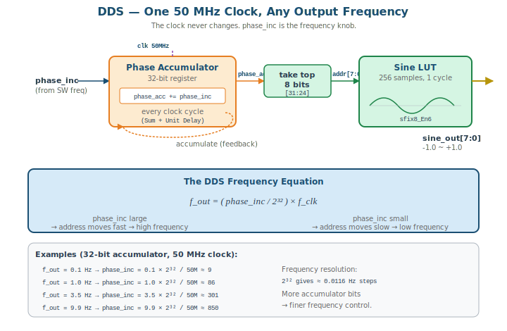
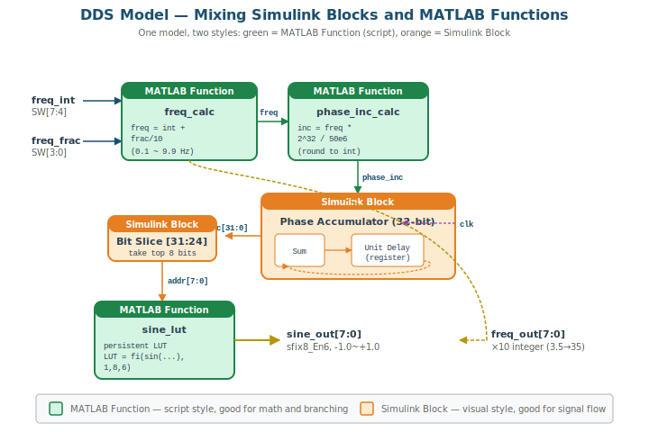
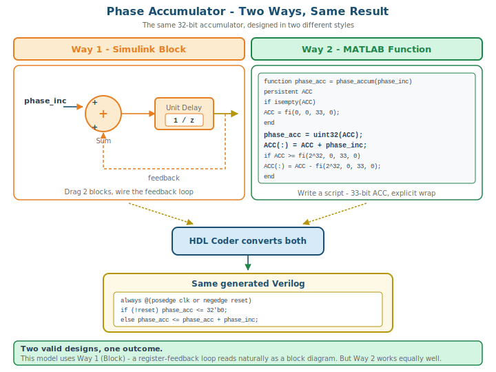
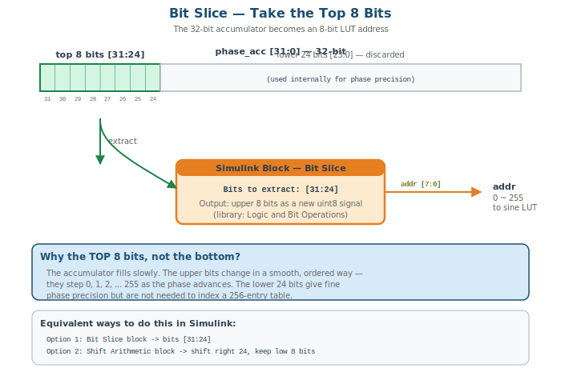
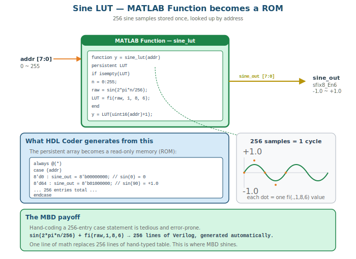

# Model-Based Design 2 — DDS 정현파 생성기 (전반부 초안)

> **본 문서는 MBD 2 전반부 초안이다.** MATLAB 모델링 → Simulink 시뮬 → HDL 생성 → ModelSim 시뮬까지를 다룬다.
> MBD 2 후반부(AI 코딩 표시 모듈)와 MBD 3(보드 구현 + 학기 마무리)는 별도 작성 예정이며, 전체 구조 확정 후 통합한다.

## 1. 본 회 개요

### 학습 목표

- DDS(Direct Digital Synthesis)의 원리를 이해한다 — 하나의 고정 클럭으로 다양한 주파수를 만든다
- Phase accumulator와 LUT 기반 정현파 생성 구조를 안다
- Simulink Block과 MATLAB Function을 **한 모델 안에서 혼합**하여 설계한다
- MBD 1에서 배운 fixed-point 표현(`fi()`, sfix/ufix)을 신호와 LUT 값에 적용한다
- fixed-point 양자화 오차가 설계 단계마다 어떻게 누적되는지 추적한다
- 모델 → Simulink 시뮬 → HDL 생성 → ModelSim 시뮬까지 끝-끝 흐름을 수행한다

### MBD 1과의 연결

MBD 1에서 모듈 1개(Counter, Decoder)로 끝-끝 사이클을 한 바퀴 돌았다. MBD 2는 **여러 모듈로 구성된 시스템**을 만든다. MBD 1의 자산이 그대로 이어진다:

- **Counter 개념** → DDS의 phase accumulator (Counter를 일반화한 것)
- **Block 방식 / Function 방식** → 이번엔 한 모델에서 둘을 섞는다
- **fixed-point `fi()`** → LUT 값을 `sfix8_En6`로 저장

### MBD 2의 범위

| 회 | 범위 |
|---|---|
| **MBD 2 (오늘)** | DDS 정현파 생성기 — 모델링 → 시뮬 → HDL 생성 → ModelSim |
| **MBD 3** | AI 코딩으로 7-seg/LED 표시 모듈 → FPGA 보드 구현 → 학기 마무리 |

오늘은 **MATLAB/Simulink 도구에 집중**한다. 정현파를 만드는 코어를 설계하고 HDL까지 뽑는다.

---

## 2. DDS 원리 — 하나의 클럭, 다양한 주파수

### 2.1 문제 — 주파수를 어떻게 바꾸나

50MHz 클럭이 하나 있다. 이걸로 0.1Hz 정현파도, 9.9Hz 정현파도 만들고 싶다. 클럭을 바꿀 수 있을까?

- **클럭을 직접 바꾸는 것은 위험하다.** 여러 클럭 소스를 스위치로 고르면 클럭 도메인이 깨지고 글리치가 생긴다. 본 강의에서 일관되게 지킨 "단일 클럭 도메인" 원칙에 어긋난다.
- **해법: 클럭은 그대로 두고, 누적 속도를 바꾼다.** 이것이 DDS다.

### 2.2 DDS의 핵심 — Phase Accumulator



DDS는 세 부분으로 구성된다:

1. **Phase accumulator** — 매 클럭마다 `phase_inc`를 더하는 32-bit 레지스터
2. **Bit slice** — accumulator의 상위 8-bit를 LUT 주소로 사용
3. **Sine LUT** — 256 샘플 정현파 테이블

동작:

```
매 클럭:  phase_acc = phase_acc + phase_inc
주소:     addr = phase_acc[31:24]   (상위 8-bit)
출력:     sine_out = LUT[addr]
```

`phase_inc`가 크면 accumulator가 빨리 차서 주소가 빨리 넘어간다 → 높은 주파수.
`phase_inc`가 작으면 천천히 → 낮은 주파수.

### 2.3 DDS 주파수 공식

```
f_out = ( phase_inc / 2^32 ) × f_clk
```

- `f_clk` = 50 MHz (고정)
- `2^32` = accumulator가 한 바퀴 도는 데 필요한 누적량
- `phase_inc` = 우리가 조절하는 값

역산하면, 원하는 주파수에서 `phase_inc`를 구할 수 있다:

```
phase_inc = f_out × 2^32 / f_clk = f_out × 2^32 / 50,000,000
```

| 원하는 f_out | phase_inc 계산 | 반올림 |
|---|---|---:|
| 0.1 Hz | 0.1 × 2³² / 50M | 9 |
| 1.0 Hz | 1.0 × 2³² / 50M | 86 |
| 3.5 Hz | 3.5 × 2³² / 50M | 301 |
| 9.9 Hz | 9.9 × 2³² / 50M | 850 |

### 2.4 왜 32-bit accumulator인가

주파수 해상도는 accumulator 비트 수가 결정한다:

```
f_resolution = f_clk / 2^N
```

| accumulator 비트 | 해상도 | 0.1Hz 단위 표현 가능? |
|:---:|---|:---:|
| 24-bit | 2.98 Hz | ❌ (0.1Hz가 phase_inc 0.03이 됨) |
| 28-bit | 0.186 Hz | ❌ (아직 부족) |
| **32-bit** | **0.0116 Hz** | ✅ |

본 강의는 0.1Hz 단위로 주파수를 조절하므로 **32-bit accumulator**가 필요하다. 24-bit로는 0.1Hz가 표현되지 않는다 (반올림하면 phase_inc가 0).

> 💡 **TIP:** "주파수 해상도를 높이려면 accumulator를 키운다" — 이것이 DDS의 핵심 trade-off다. 더 세밀한 주파수 조절이 필요하면 비트를 늘리고, 그만큼 레지스터 면적이 커진다.

---

## 3. 시스템 사양

### 3.1 만들 시스템 — DDS 정현파 생성기

| 항목 | 사양 |
|---|---|
| 시스템 | DDS 기반 정현파 생성기 |
| 클럭 | 50 MHz 단일 클럭 (KEY[0] = `rst_n`, active-low) |
| Phase accumulator | 32-bit |
| Sine LUT | 256 샘플, 1주기 |
| LUT 값 타입 | `sfix8_En6` (signed 8-bit, 6-bit fraction) |
| 출력 주파수 | 0.1 ~ 9.9 Hz (0.1Hz 단위) |
| 주파수 입력 | SW[7:4] 정수부 BCD, SW[3:0] 소수부 BCD |

### 3.2 LUT 값의 fixed-point — `sfix8_En6`

정현파 값은 -1.0 ~ +1.0 범위. MBD 1에서 배운 `fi()` 함수로 표현한다:

```matlab
fi(value, 1, 8, 6)    % signed, 8-bit total, 6-bit fraction
```

`sfix8_En6` 분석:
- 총 8-bit, signed
- 소수부 6-bit → 정수부 = 8 - 1 - 6 = **1-bit**
- 표현 범위: **-2.0 ~ +1.984375**
- 해상도: 2⁻⁶ = 0.015625

정현파 ±1.0은 이 범위(-2.0~+1.98) 안에 충분히 들어간다.

확인:
- `+1.0` → 1.0 × 2⁶ = 64 → 이진 `0 1 000000` → 표현 가능 ✓
- `-1.0` → -1.0 × 2⁶ = -64 → 이진 `1 1 000000` (2의 보수) → 표현 가능 ✓

### 3.3 입출력 인터페이스

오늘 만들 모델의 인터페이스:

```
입력:
  clk, rst_n                        클럭, 리셋 (active-low)
  freq_int   [3:0]                  주파수 정수부 (SW[7:4], BCD 0~9)
  freq_frac  [3:0]                  주파수 소수부 (SW[3:0], BCD 0~9)

출력:
  sine_out   [7:0]   sfix8_En6      정현파 값 (-1.0 ~ +1.0)
  freq_out   [7:0]                  현재 주파수 ×10 정수 (예: 3.5Hz → 35)
```

> 📝 **NOTE:** `freq_out`은 모델이 "지금 몇 Hz인지"를 내보내는 출력이다. MBD 3에서 AI가 만들 7-seg 표시 모듈이 이 값을 받아 화면에 표시한다. 모델이 주파수 값을 알고 있으므로 표시 모듈은 표시만 하면 된다.

---

## 4. 모델링 — Block과 Function 혼합



이번 모델의 묘미는 **Simulink Block과 MATLAB Function을 한 캔버스에서 섞는 것**이다. MBD 1에서 두 방식을 따로 배웠다면, 이번엔 각 부분에 적합한 방식을 골라 한 모델에 통합한다.

### 4.1 방식 배정

| 처리 부분 | 방식 | 이유 |
|---|---|---|
| `freq_calc` — 주파수 계산 | MATLAB Function | 정수+소수/10 산술, 스크립트가 명확 |
| `phase_inc_calc` — phase_inc 역산 | MATLAB Function | 곱셈·반올림 수식, 스크립트가 명확 |
| Phase accumulator | Block **또는** Function | 두 방식 모두 가능 — 본 모델은 Block 채택 (4.4 참조) |
| Bit slice [31:24] | Simulink Block | 신호에서 비트 추출, Block이 직관적 |
| `sine_lut` — LUT | MATLAB Function | LUT 생성·인덱싱, 스크립트가 명확 |

원칙: **신호 흐름·레지스터는 Block, 수식·인덱싱은 Function** (MBD 1의 가르침 그대로). 단, 누산기처럼 **두 방식 모두 자연스러운 경우**도 있다 — 4.4에서 두 방식을 모두 본다.

### 4.2 freq_calc — 주파수 계산 (MATLAB Function)

SW로 들어온 BCD 두 자리를 실제 주파수로 합친다.

**입출력 데이터 타입:**

| 신호 | 타입 | 의미 |
|---|---|---|
| `freq_int` | `ufix4_En0` | 정수부 BCD (0~9, SW[7:4]) |
| `freq_frac` | `ufix4_En0` | 소수부 BCD (0~9, SW[3:0]) |
| `freq` | `ufix16_En12` | 실제 주파수 (0.1~9.9 Hz), 소수 fixed-point |
| `freq_out` | `ufix8_En0` | 표시용 ×10 정수 (3.5Hz → 35) |

```matlab
function [freq, freq_out] = freq_calc(freq_int, freq_frac)
    % freq_int  : ufix4_En0   (0~9, SW[7:4])
    % freq_frac : ufix4_En0   (0~9, SW[3:0])
    % freq      : ufix16_En12 (0.1~9.9 Hz, 소수 fixed-point)
    % freq_out  : ufix8_En0   (표시용 ×10 정수, 3.5Hz -> 35)

    persistent FREQ FREQ_OUT
    if isempty(FREQ)
        FREQ     = fi(0, 0, 16, 12);   % 타입 확정: ufix16_En12
        FREQ_OUT = fi(0, 0, 8, 0);     % 타입 확정: ufix8_En0
    end

    % 소수부를 fixed-point으로: freq_frac / 10 = freq_frac * 0.1
    % (FPGA에서 나눗셈기는 비싸므로 상수 곱셈으로 처리)
    tmp = fi(freq_frac, 0, 16, 12) * fi(0.1, 0, 16, 12);

    % 정수부 + 소수부  ->  FREQ
    FREQ(:) = fi(freq_int, 0, 16, 12) + tmp;

    % 표시용 x10 정수  ->  FREQ_OUT
    FREQ_OUT(:) = fi(freq_int, 0, 8, 0) * fi(10, 0, 8, 0) ...
                + fi(freq_frac, 0, 8, 0);

    freq     = FREQ;
    freq_out = FREQ_OUT;
end
```

`persistent` 변수를 `fi()`로 초기화하면 그 변수의 fixed-point 타입이 첫 호출 때 확정된다. 이후 `FREQ(:) = ...` 대입은 **타입을 유지한 채 값만 갱신**한다. 모든 `fi()`는 인자 4개(`value, signed, wordLength, fractionLength`)를 명시하여 타입을 모호하게 두지 않는다 — MATLAB Function은 HDL로 변환되므로 모든 신호 타입을 엔지니어가 결정해야 한다.

> 💡 **TIP:** `freq_frac / 10` 대신 `freq_frac * 0.1`을 썼다. FPGA에서 **나눗셈기는 곱셈기보다 훨씬 크고 느린 하드웨어**다. `/10` 같은 상수 나눗셈은 `× 0.1` 상수 곱셈으로 바꾸는 것이 정석이다. `fi(0.1, 0, 16, 12)`는 0.1을 `ufix16_En12`로 양자화한 값 — 0.1은 2의 거듭제곱이 아니므로 미세한 양자화 오차가 생긴다 (4.8 참조).

### 4.3 phase_inc_calc — phase_inc 역산 (MATLAB Function)

주파수에서 phase_inc를 계산한다. DDS 공식의 역산이다.

**입출력 데이터 타입:**

| 신호 | 타입 | 의미 |
|---|---|---|
| `freq` | `ufix16_En12` | 입력 주파수 (0.1~9.9 Hz) |
| `phase_inc` | `uint32` | 32-bit 위상 증분 |

DDS 역산 공식:

```
phase_inc = freq × 2^32 / 50,000,000
```

```matlab
function phase_inc = phase_inc_calc(freq)
    % freq      : ufix16_En12 (0.1~9.9 Hz)
    % phase_inc : uint32      (32-bit 위상 증분)

    persistent PHASE_INC
    if isempty(PHASE_INC)
        PHASE_INC = fi(0, 0, 32, 0);   % 타입 확정: ufix32_En0 (= uint32)
    end

    % DDS 역산: phase_inc = freq * 2^32 / 50e6
    %   2^32 / 50e6 = 85.8993... (스케일 상수)
    SCALE = fi(85.8993459, 0, 32, 16);     % 상수도 타입 명시

    PHASE_INC(:) = freq * SCALE;           % 곱셈 후 ufix32_En0로 양자화

    phase_inc = PHASE_INC;
end
```

`freq`(ufix16_En12)에 스케일 상수를 곱하면 `phase_inc`가 나온다. `PHASE_INC`가 `ufix32_En0`(소수부 0 = 정수)이므로 `(:)` 대입 시 자동으로 정수로 반올림된다.

> 📝 **NOTE:** `2^32 / 50e6 = 85.8993...`는 무리수에 가깝다. 이 상수를 `fi(..., 0, 32, 16)`으로 표현하는 순간 한 번 양자화되고, `PHASE_INC(:)` 대입에서 정수로 반올림되며 또 한 번 양자화된다. 4.8에서 이 양자화 누적을 추적한다.

### 4.4 Phase accumulator — 두 가지 방식

매 클럭마다 `phase_inc`를 누적하는 레지스터. **MBD 1의 Counter를 일반화한 것** — Counter는 매번 1을 더했고, 여기서는 `phase_inc`를 더한다.

이 누산기는 **Simulink Block과 MATLAB Function 두 가지 방식으로 모두 설계할 수 있다.** MBD 1에서 두 방식을 각각 배웠다면, 여기서는 같은 것을 두 방식으로 만들어 본다.



#### 4.4.1 방식 1 — Simulink Block

```
[phase_inc]──┐
             ├──[Sum]──[Unit Delay]──┬──→ phase_acc
             └────────────────────────┘
                     (feedback)
```

- **Sum** 블록: 입력 두 개 (`+`, `+`), 출력 데이터 타입 `uint32`
- **Unit Delay** 블록: initial value 0, 데이터 타입 `uint32`
- 출력을 다시 Sum 입력으로 피드백 → 누적

> 32-bit 덧셈에서 overflow(2³² 초과)는 자연스럽게 wrap-around된다. 이것이 정상 동작 — accumulator가 한 바퀴 돌면 정현파도 한 주기 완성. Sum 블록의 *Saturate on integer overflow* 옵션은 **체크 해제**(wrap)로 둔다.

#### 4.4.2 방식 2 — MATLAB Function

같은 누산기를 스크립트로 작성하면 다음과 같다. 다른 세 함수와 마찬가지로 `persistent` + `fi()` + `(:)` 대입 스타일을 따른다.

```matlab
function phase_acc = phase_accum(phase_inc)
    % phase_inc : uint32      (32-bit 위상 증분)
    % phase_acc : uint32      (32-bit 누적 위상)

    persistent ACC
    if isempty(ACC)
        ACC = fi(0, 0, 33, 0);          % 33-bit, 덧셈 여유 1-bit
    end

    phase_acc = uint32(ACC);            % 하위 32-bit가 위상값

    ACC(:) = ACC + phase_inc;           % 33-bit라 2^32를 넘겨도 포화 안 됨
    if ACC >= fi(2^32, 0, 33, 0)
        ACC(:) = ACC - fi(2^32, 0, 33, 0);   % 넘친 만큼만 남김
    end
end
```

- `ACC = fi(0, 0, 33, 0)` — accumulator를 **33-bit**로 둔다. 32-bit가 아니라 33-bit인 이유: `ACC + phase_inc`가 2³²를 넘을 수 있어야 `if` 비교가 동작하기 때문이다. 32-bit로 두면 덧셈이 먼저 한계에 걸려 `if`에 도달하지 못한다.
- `ACC(:) = ACC + phase_inc` — 누적. 33-bit 폭이라 2³²를 넘긴 값이 그대로 담긴다.
- `if ACC >= fi(2^32, 0, 33, 0)` — 2³²에 도달했는지 검사. 도달했으면 wrap한다.
- `ACC(:) = ACC - fi(2^32, 0, 33, 0)` — wrap은 **`0`으로 만드는 것이 아니라 2³²를 빼는 것**이다. 넘친 만큼(초과 위상)을 남겨야 위상이 정확하다. `0`으로 만들면 매 주기 초과분을 잃어 주파수가 어긋난다.
- 출력 `phase_acc = uint32(ACC)` — 하위 32-bit가 실제 위상값이다.

#### 4.4.3 두 방식 비교 — 본 모델의 선택

| 측면 | 방식 1 (Block) | 방식 2 (Function) |
|---|---|---|
| 표현 | Sum + Unit Delay 블록도 | persistent 변수 스크립트 |
| 레지스터 | Unit Delay 블록 | `persistent ACC` |
| Overflow 처리 | Sum 블록 *Saturate* 해제 (wrap) | 명시적 `if` 비교 + 뺄셈 |
| HDL 변환 결과 | **동일** | **동일** |


두 방식 모두 HDL Coder가 변환하면 똑같은 Verilog가 나온다 — 32-bit `reg`와 누산 `always` 블록.

> **본 모델은 방식 1 (Block) 을 채택한다.** 누산기는 레지스터 피드백 구조라 블록 다이어그램으로 읽는 것이 직관적이기 때문이다. 다만 방식 2도 똑같이 유효하며, 알아 두면 상황에 따라 선택할 수 있다.

### 4.5 Bit slice — 상위 8-bit 추출 (Simulink Block)

32-bit accumulator에서 LUT 주소가 될 상위 8-bit를 뽑는다.



- **Bit Slice** 블록 (또는 **Extract Bits** 블록): `[31:24]` 선택
- 또는 **Shift Arithmetic** 블록으로 24-bit 오른쪽 시프트 후 하위 8-bit

출력 `addr [7:0]` — 0~255 범위.

> 💡 **TIP:** 왜 상위 비트인가? accumulator가 천천히 차오를 때, 상위 비트가 LSB보다 먼저 안정적으로 변한다. 상위 8-bit를 쓰면 256단계로 매끄럽게 주소가 증가한다.

### 4.6 sine_lut — 정현파 LUT (MATLAB Function)

256 샘플 정현파 테이블. `persistent` 변수로 LUT와 출력을 다룬다.



**입출력 데이터 타입:**

| 신호 | 타입 | 의미 |
|---|---|---|
| `addr` | `ufix8_En0` | LUT 주소 (0~255) |
| `y` | `sfix8_En6` | 정현파 값 (-1.0~+1.0) |

```matlab
function y = sine_lut(addr)
    % addr : ufix8_En0  (0~255, LUT 주소)
    % y    : sfix8_En6  (-1.0~+1.0, 정현파 값)

    persistent LUT Y
    if isempty(LUT)
        n   = 0:255;
        raw = sin(2*pi*n/256);          % 1주기 256점
        LUT = fi(raw, 1, 8, 6);         % sfix8_En6로 양자화
        Y   = fi(0, 1, 8, 6);           % 출력 타입 확정: sfix8_En6
    end

    Y(:) = LUT(uint16(addr) + 1);       % 타입 유지, 값만 갱신

    y = Y;
end
```

이 함수의 핵심:
- `persistent LUT` — 256개 sine 값을 한 번만 생성. HDL Coder는 이 배열을 **ROM**으로 변환한다
- `fi(raw, 1, 8, 6)` — MBD 1에서 배운 fixed-point 양자화. 256개 값을 모두 `sfix8_En6`로
- `persistent Y` + `Y(:) = ...` — 출력 타입을 `sfix8_En6`로 고정. `freq_calc`, `phase_inc_calc`와 같은 스타일
- `uint16(addr) + 1` — MATLAB 인덱스는 1부터 시작하므로 `+1`. `addr`(0~255)을 먼저 `uint16`으로 넓힌 뒤 더한다 — `addr=255`일 때 인덱스 256이 `uint8` 범위(0~255)를 넘기 때문이다. `double` 대신 `uint16`을 쓰는 이유는 합성 영역에 부동소수점을 두지 않기 위해서다

세 MATLAB Function(`freq_calc`, `phase_inc_calc`, `sine_lut`)이 모두 같은 패턴을 쓴다 — `persistent` 변수를 `fi()`로 초기화하고, `(:)` 대입으로 타입을 유지한 채 값만 갱신.

### 4.7 전체 모델 결선

위 5개 부분을 Simulink 캔버스에서 연결한다:

```
freq_int  ─┐
           ├→ [freq_calc]─→ freq ──→ [phase_inc_calc]─→ phase_inc
freq_frac ─┘       │                                        │
                   └→ freq_out (출력)                        ↓
                                              [Phase Accumulator]
                                                        │
                                                phase_acc[31:0]
                                                        ↓
                                              [Bit Slice 31:24]
                                                        │
                                                   addr[7:0]
                                                        ↓
                                                  [sine_lut]
                                                        │
                                                  sine_out (출력)
```

#### 빠른 경로와 느린 경로 — 무엇이 진짜 50MHz를 요구하나

이 모델의 신호 경로는 속도 요구가 서로 다른 **두 부류**로 나뉜다.

| 경로 | 구성 | 속도 요구 |
|---|---|---|
| **빠른 경로** | Phase Accumulator → Bit Slice → sine_lut | 매 클럭(50MHz) 동작 |
| **느린 경로** | freq_calc → phase_inc_calc | SW가 바뀔 때만 값이 달라짐 |

- **빠른 경로**는 매 클럭 위상을 누적하고 LUT를 읽는다. 진짜로 50MHz를 만족해야 한다. 다행히 이 경로는 덧셈·비교·메모리 읽기뿐이라 단순하다 — Cyclone III/II에서 여유 있게 통과한다.

- **느린 경로**의 `freq_calc`·`phase_inc_calc`는 곱셈을 포함해 무거워 보인다. 하지만 이 경로의 입력은 **SW 슬라이드 스위치**다. 사람이 손으로 맞추는 값이라, 한 번 설정하면 몇 초~몇 분씩 그대로다. `phase_inc`는 SW가 바뀔 때만 새 값이 되고, 그 외에는 계속 같은 값이다.

> 💡 **TIP:** 느린 경로의 곱셈은 타이밍이 다소 빠듯해도 실동작에 영향이 없다. SW를 바꾼 뒤 `phase_inc`가 확정되기까지 몇 클럭(수십 ns)이 걸려도 사람 눈에는 즉각적이다. 합성 후 Quartus 타이밍 리포트에서 Fmax를 제한하는 critical path가 이 느린 경로에 있다면, 실동작은 멀쩡하다. **진짜 중요한 것은 빠른 경로(accumulator → LUT)가 50MHz를 만족하는가**이며, 이쪽은 단순해서 문제되지 않는다. "어느 경로가 진짜 critical path인가"를 구분하는 것이 하드웨어를 의식하는 설계의 핵심이다.

### 4.8 양자화 오차 체인 — fixed-point 설계의 실제

`freq`를 소수 fixed-point으로 두면, 입력 주파수가 실제 출력 주파수까지 가는 동안 **양자화가 여러 번 일어난다.** 3.5Hz를 입력했을 때를 따라가 보자.

| 단계 | 처리 | 값 | 양자화 |
|---|---|---|---|
| 입력 | SW: freq_int=3, freq_frac=5 | 3, 5 (정수) | 없음 |
| `freq_calc` | `fi(0.1, 0,16,12)` 상수 | 0.1 → 410/4096 ≈ 0.100098 | **1차 오차** (0.1 양자화) |
| `freq_calc` | `5 × 0.100098` | ≈ 0.50049 | 곱셈 결과 |
| `freq_calc` | `3 + 0.50049` | freq ≈ 3.50049 (ufix16_En12) | — |
| `phase_inc_calc` | 스케일 상수 `fi(85.899..., 0,32,16)` | 85.8993 → 양자화됨 | **2차 오차** |
| `phase_inc_calc` | `freq × SCALE` 을 정수로 | 약 300.7 → 301 | **3차 오차** (정수 반올림) |
| 하드웨어 | `f = phase_inc × 50e6 / 2³²` | 301 × 50e6 / 2³² ≈ 3.5022 Hz | — |

입력은 3.5Hz인데 **실제 출력은 약 3.5022Hz**다. 약 0.06%의 오차.

이 오차는 어디서 왔나:
- `0.1`을 `ufix16_En12`로 표현하는 순간부터 미세 오차가 시작된다 (0.1은 2의 거듭제곱이 아님)
- 가장 큰 오차는 **phase_inc가 정수여야 하기 때문**에 생긴다. 300.7을 301로 반올림하는 순간 주파수가 어긋난다
- accumulator 비트(32-bit)가 클수록 이 반올림 오차가 작아진다 — 4절에서 다룬 "해상도" 이야기

> 💡 **TIP:** 이것이 fixed-point 설계의 본질이다. 오차는 단계마다 생기고 누적된다. 엔지니어는 "어디서 양자화가 일어나고, 최종 오차가 허용 범위인가"를 알고 있어야 한다. MBD는 각 신호의 타입을 명시하게 함으로써 이 오차를 **설계 시점에 보이게** 만든다 — 손코딩에서는 암묵적으로 숨어 있던 것이다.

---

## 5. Simulink 시뮬레이션

### 5.1 시뮬 설정

- Solver: Fixed-step, discrete
- Sample time: 클럭 1주기에 해당하는 값
- Stop time: 정현파 몇 주기가 보일 만큼

### 5.2 시뮬에서 확인할 것

**확인 1 — 정현파가 나오는가**

`sine_out`을 Scope로 본다. 매끄러운 정현파가 보여야 한다. 256 샘플이므로 계단이 거의 안 보이는 부드러운 곡선.

**확인 2 — 주파수가 SW 입력대로 나오는가**

`freq_int=3, freq_frac=5` (3.5Hz)로 설정 → Scope에서 1초에 3.5주기가 나오는지 확인.

**확인 3 — fixed-point 양자화 효과**

`sine_out`은 `sfix8_En6`이므로 0.015625 단위로 양자화되어 있다. 이상적 sine과 미세하게 다르다 — 이것이 양자화 오차. Scope를 확대하면 계단이 보인다.

### 5.3 주파수 가변 실험

`freq_int`, `freq_frac`를 바꿔가며 시뮬:

| freq_int | freq_frac | f_out | 1주기 |
|:---:|:---:|---:|---:|
| 0 | 1 | 0.1 Hz | 10초 |
| 1 | 0 | 1.0 Hz | 1초 |
| 3 | 5 | 3.5 Hz | 0.29초 |
| 9 | 9 | 9.9 Hz | 0.10초 |

> 💡 **TIP:** 시뮬레이션 시간축에서는 주파수를 빠르게 잡아도 무방하다. ModelSim 시뮬(7절)에서는 시뮬 길이를 줄이기 위해 더 빠른 주파수를 쓴다. 보드(MBD 3)에서는 눈으로 봐야 하므로 느린 주파수를 쓴다 — 같은 하드웨어, 다른 phase_inc.

---

## 6. HDL 생성

### 6.1 Workflow Advisor 실행

Model 우클릭 → HDL Code → HDL Workflow Advisor.

### 6.2 HDL 옵션 — MBD 1과 동일

MBD 1 섹션 6.3에서 익힌 설정을 그대로 쓴다.

| 옵션 | 값 |
|---|---|
| Target / Synthesis tool | Generic ASIC/FPGA |
| Target language | Verilog |
| Reset type | Asynchronous |
| Reset asserted level | Active-low |
| Reset input port (포트 이름) | `rst_n` |
| Target Verilog version | Verilog-2001 |
| Clock enable | 생성되면 그대로 둠 (top에서 `1'b1`로 묶음) |

> ⚠️ Quartus 13 호환을 위해 **Verilog-2001** 필수. SystemVerilog 구문이 섞이면 Quartus 13에서 합성 실패.

> 📝 **NOTE:** reset 포트 이름을 `rst_n`으로 지정하고, clock enable 포트가 생기면 top wrapper에서 `1'b1`로 묶는다 — 자세한 내용은 MBD 1 섹션 6.3 참조.

### 6.3 Generate RTL Code

코드 생성 후 결과 폴더 확인:

```
hdl_prj/hdlsrc/dds_sine/dds_sine.v
```

### 6.4 생성 코드 확인

생성된 `dds_sine.v`에서 다음을 확인한다:

- **Phase accumulator** — 32-bit `reg`와 `always @(posedge clk ...)` 누산
- **Sine LUT** — `case`문 또는 메모리 배열로 변환된 256-entry ROM
- **Bit slice** — `phase_acc[31:24]` 형태의 비트 선택

```verilog
// 생성 코드 예시 (일부)
reg [31:0] phase_acc;

always @(posedge clk or negedge rst_n)
  if (!rst_n)
    phase_acc <= 32'b0;
  else
    phase_acc <= phase_acc + phase_inc;

wire [7:0] addr = phase_acc[31:24];

// sine LUT는 case문으로 변환됨
always @(*)
  case (addr)
    8'd0  : sine_out = 8'b00000000;
    8'd1  : sine_out = 8'b00000011;
    ...
    8'd255: sine_out = 8'b11111101;
  endcase
```

손코딩으로 256-entry case문을 직접 타이핑하는 것은 매우 번거롭다. MBD는 `sin()` 한 줄로 이 256줄을 자동 생성한다 — **MBD가 빛나는 지점**.

---

## 7. ModelSim 시뮬레이션 — MBD 2의 종착점

HDL 생성으로 끝이 아니다. **생성된 Verilog가 정말 정현파를 만드는지 ModelSim에서 확인**한다. 이것이 MBD 2의 종착점이다.

### 7.1 왜 ModelSim에서 또 보는가

MBD 1에서 배운 검증의 원리:

- **Simulink 시뮬** — 알고리즘 검증 (모델이 옳은가)
- **ModelSim 시뮬** — 합성 가능 Verilog 검증 (생성된 코드가 옳은가)

두 시뮬 결과가 일치해야 HDL 변환이 올바르다.

### 7.2 ModelSim용 주파수

보드용 느린 주파수(0.1~9.9Hz)를 ModelSim에서 그대로 쓰면, 1주기를 보려고 수억 클럭을 시뮬해야 한다 — 비현실적이다.

해결: **ModelSim testbench에서는 phase_inc를 큰 값으로 준다.** MBD 1에서 `tick_1ms`의 `DIV`를 testbench에서 작게 override했던 것과 같은 원리.

- 보드: phase_inc 9 ~ 850 (0.1~9.9Hz, 느림)
- ModelSim: phase_inc를 크게 (예: 출력 약 1~10kHz) → 1주기가 수천~수만 클럭 → 시뮬 가벼움

### 7.3 ModelSim 시뮬 실행

HDL Coder가 testbench(`dds_sine_tb.v`)도 자동 생성한다. ModelSim에서:

```tcl
vlib work
vlog -novopt dds_sine.v dds_sine_tb.v
vsim -novopt work.dds_sine_tb
add wave -position end /dds_sine_tb/*
run -all
```

### 7.4 파형에서 확인할 것

- **`sine_out`을 analog 포맷으로** 본다 (ModelSim Wave에서 우클릭 → Format → Analog)
- 디지털 값이 아니라 **정현파 곡선**으로 보인다
- phase_acc가 증가하며 sine_out이 -1.0~+1.0을 매끄럽게 오르내리는지 확인

### 7.5 Simulink 결과와 비교

- Simulink Scope의 정현파 모양
- ModelSim Wave의 정현파 모양
- **두 파형이 같은 모양**이면 HDL 변환 성공

> 💡 **TIP:** ModelSim Wave에서 `sine_out`을 analog로 보는 것이 핵심이다. 8-bit 값을 숫자로 나열하면 정현파인지 알 수 없지만, analog 포맷으로 보면 곡선이 그대로 보인다.

---

## 8. 정리

오늘 MBD 2 전반부에서 한 것:

- **DDS 원리** — 하나의 50MHz 클럭으로 phase_inc를 바꿔 다양한 주파수 생성
- **Block + Function 혼합 모델** — 누산기는 Block, 수식·LUT는 Function
- **fixed-point LUT** — 256 샘플 정현파를 `sfix8_En6`로
- **끝-끝 흐름** — 모델링 → Simulink 시뮬 → HDL 생성 → ModelSim 시뮬
- **종착점** — ModelSim 파형에서 정현파 확인

### 다음 — MBD 2 후반부 / MBD 3

- **MBD 2 후반부:** AI 코딩으로 7-seg/LED 표시 모듈 생성 (별도 작성)
- **MBD 3:** FPGA 보드 구현 + 학기 마무리

오늘 만든 `dds_sine.v`가 다음 단계의 코어가 된다. 본인 노트북에 잘 보관할 것.
