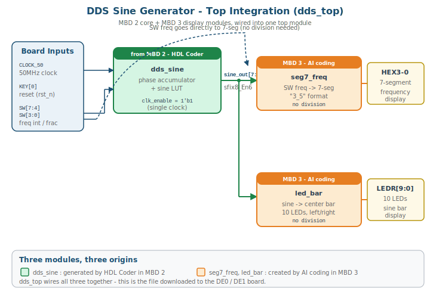
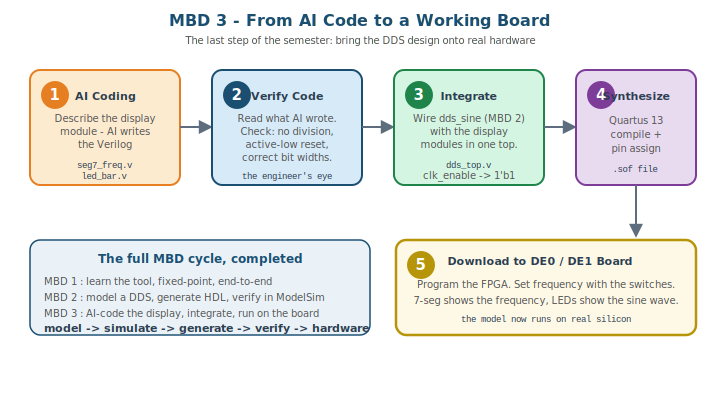

# Model-Based Design 3 — AI 코딩으로 표시 모듈 만들고 보드에 올리기

> **MBD 마지막 회.** MBD 2에서 만든 DDS 정현파 생성기를 실제 DE0/DE1 보드에서 동작시킨다.
> 표시 모듈은 AI 코딩으로 만들고, MBD 2의 `dds_sine`과 통합하여 FPGA에 다운로드한다.

## 1. 본 회 개요

### 학습 목표

- AI 코딩으로 표시 모듈(7-seg, LED)을 생성하는 과정을 본다
- AI가 생성한 코드를 **검증**하는 눈을 기른다
- MBD 2의 `dds_sine`(HDL Coder 생성)과 표시 모듈을 하나의 top으로 통합한다
- Quartus 13으로 합성하고 DE0/DE1 보드에 다운로드한다
- 모델이 실제 하드웨어에서 동작하는 것을 확인하며 MBD 전체 사이클을 완성한다

### MBD 1·2와의 연결

```
MBD 1 : 도구를 배우고, fixed-point을 익히고, 끝-끝 사이클을 한 바퀴
MBD 2 : DDS를 모델링하고, HDL을 생성하고, ModelSim에서 검증
MBD 3 : 표시 모듈을 AI로 만들고, 통합하고, 보드에서 동작 (오늘)
```

MBD 2에서 ModelSim 파형으로 정현파를 확인하고 끝났다. 오늘은 그 `dds_sine`을 **눈에 보이는 하드웨어**로 만든다 — 7-seg에 주파수가 뜨고, LED가 정현파를 따라 출렁인다.

### 오늘 만들 시스템



세 모듈을 하나로 묶는다. 각 모듈의 출처가 다르다는 점에 주목하라:

| 모듈 | 출처 | 역할 |
|---|---|---|
| `dds_sine` | **MBD 2** — HDL Coder 생성 | DDS 정현파 코어 |
| `seg7_freq` | **MBD 3** — AI 코딩 | 주파수를 7-seg에 표시 |
| `led_bar` | **MBD 3** — AI 코딩 | 정현파를 LED 막대로 표시 |
| `dds_top` | 통합 | 세 모듈을 결선, 보드에 다운로드 |

---

## 2. 오늘의 작업 흐름



다섯 단계로 진행한다:

1. **AI 코딩** — 표시 모듈을 AI에게 생성시킨다
2. **코드 검증** — AI가 쓴 코드를 엔지니어의 눈으로 점검한다
3. **통합** — `dds_sine`과 표시 모듈을 `dds_top`으로 결선한다
4. **합성** — Quartus 13으로 컴파일하고 핀을 배정한다
5. **다운로드** — FPGA에 프로그래밍하고 보드에서 동작을 확인한다

---

## 3. AI 코딩 — 표시 모듈 생성

11주에서 배운 **AI 코딩**을 다시 쓴다. 이번엔 표시 모듈을 만든다.

### 3.1 무엇을 만드나

`dds_sine`은 두 가지 출력을 낸다:

```
sine_out [7:0]  sfix8_En6   정현파 값 (-1.0 ~ +1.0)
freq_out [7:0]              현재 주파수 ×10 (3.5Hz → 35)
```

이 신호를 사람이 볼 수 있게 만드는 것이 표시 모듈이다.

| 표시 모듈 | 입력 | 출력 |
|---|---|---|
| `seg7_freq` | 주파수 (SW 입력) | 7-seg 4자리 — `3_5` 형식 |
| `led_bar` | `sine_out` | LED 10개 — 중앙 기준 좌우 막대 |

### 3.2 AI 코딩 프롬프트 — 명세를 정확히

11주에서 배운 원칙: **AI에게 정확한 명세를 줘야 정확한 코드가 나온다.** 표시 모듈의 명세를 분명히 한다.

**seg7_freq 명세 예시:**

```
주파수를 7-seg에 표시하는 Verilog 모듈을 작성한다.
- 입력: clk, rst_n(active-low), freq_int[3:0], freq_frac[3:0]
- 출력: HEX3, HEX2, HEX1, HEX0 (각 [6:0], active-low, 비트순서 {g,f,e,d,c,b,a})
- 출력은 클럭 동기 reg (always @(posedge clk or negedge rst_n))
- HEX2=정수부, HEX1='_', HEX0=소수부, HEX3=꺼짐
- '_'는 7-seg 아래쪽 가로획(세그먼트 d) 하나만 켠 모양
- 예: freq_int=3, freq_frac=5 → "3_5"
- 나눗셈/나머지 연산 사용 금지
- Verilog-2001
```

**led_bar 명세 예시:**

```
정현파 값을 LED 막대로 표시하는 Verilog 모듈을 작성한다.
- 입력: clk, rst_n(active-low), sine_out[7:0] (signed, sfix8_En6, -64~+64)
- 출력: LEDR[9:0] (active-high), 클럭 동기 reg
- 중앙 기준 좌우 막대 — 중앙은 LEDR[4]와 LEDR[5] 사이
    양수 → 중앙에서 왼쪽으로 (LEDR[9:5])
    음수 → 중앙에서 오른쪽으로 (LEDR[4:0])
- 막대는 중앙에서 바깥으로 채운다 (양수: LEDR[5]부터, 음수: LEDR[4]부터)
- 크기에 비례한 5단계 막대
- 나눗셈 사용 금지
- Verilog-2001
```

> 💡 **TIP:** 명세에 **"나눗셈 금지"**, **"active-low reset"**, **"Verilog-2001"** 같은 제약을 명시하는 것이 핵심이다. 안 적으면 AI는 나눗셈을 쓴 코드, SystemVerilog 구문이 섞인 코드를 줄 수 있다. 본 강의가 11주 내내 강조한 SIBCVT — 명세(Spec)를 정확히 줘야 한다.

> 📝 **NOTE:** 명세는 "의도"를 전달하는 것이지 코드를 글로 받아쓰는 것이 아니다. 위 명세로 AI에게 시키면 — 의도에 맞는 코드가 나오지만, 7-seg 패턴 값이나 5단계 임계값 같은 세부는 AI마다 다를 수 있다. **그것이 정상이다.** AI가 만든 코드가 어떻든, 다음 4장의 검증을 거쳐 다듬는다. 본 강의에서 학생이 받는 `seg7_freq.v`, `led_bar.v`는 이 검증을 이미 통과한 배포본이다.

### 3.3 AI는 도구, 검증은 엔지니어의 몫

AI가 코드를 한 번에 정확히 줄 수도, 틀린 코드를 줄 수도 있다. **그것을 판단하는 것이 다음 단계다.** AI 코딩은 빠르지만, 그 결과를 그대로 믿으면 안 된다.

---

## 4. AI 코드 검증 — 엔지니어의 눈

AI가 준 코드를 보드에 올리기 전에 **반드시 검증**한다. 본 강의 전체를 관통한 메시지 — AI는 망치, 검증 능력은 눈.

### 4.1 검증 체크리스트

표시 모듈 코드를 받으면 다음을 점검한다:

| 점검 항목 | 왜 |
|---|---|
| **나눗셈/나머지(`/`, `%`)가 있는가** | FPGA에서 나눗셈기는 크고 느리다. 있으면 비교·case로 고친다 |
| **reset이 active-low(`rst_n`), 비동기인가** | 본 강의 표준. `posedge clk or negedge rst_n` |
| **비트 폭이 맞는가** | 입출력 폭, 중간 신호 폭. `sine_out`은 8-bit signed |
| **`always @(*)` 블록이 latch를 만들지 않는가** | 모든 분기에서 출력이 대입되는가 (`else`/`default`) |
| **SystemVerilog 구문이 섞이지 않았는가** | Quartus 13은 Verilog-2001만 받는다 |
| **7-seg active-low, 비트순서가 맞는가** | `{g,f,e,d,c,b,a}`, 0=ON |

### 4.2 흔한 AI 코드 문제 — 나눗셈

AI에게 "주파수를 십의 자리와 일의 자리로 나눠라"라고 하면 — 십중팔구 이렇게 준다:

```verilog
tens = freq / 10;      // 나눗셈
ones = freq % 10;      // 나머지
```

동작은 한다. 그러나 FPGA에서 나눗셈기는 비싼 하드웨어다. 이 코드를 그대로 합성하면 불필요하게 큰 회로가 생긴다.

**검증으로 잡아낸 뒤 고친다.** 본 강의의 표시 모듈은 SW의 BCD 입력을 그대로 받으므로 나눗셈이 아예 필요 없다 — `seg7_freq`는 `freq_int`, `freq_frac`을 직접 디코딩한다.

> 📝 **NOTE:** "AI가 준 코드에 나눗셈이 있다 → 검증에서 발견 → 나눗셈 없는 방식으로 수정." 이 과정 자체가 MBD 3의 핵심 학습이다. AI가 빠르게 초안을 주고, 엔지니어가 하드웨어 관점에서 다듬는다.

### 4.3 검증된 표시 모듈

검증을 거친 표시 모듈 두 개를 사용한다. (강의자가 배포한다.)

- `seg7_freq.v` — 주파수 7-seg 표시. 나눗셈 없음, `rst_n` active-low
- `led_bar.v` — 정현파 LED 막대. 나눗셈 없음, 중앙 기준 좌우 막대

---

## 5. 통합 — dds_top

검증된 표시 모듈과 MBD 2의 `dds_sine`을 하나의 top 모듈로 결선한다.

### 5.1 dds_top의 구조

```
dds_top
 ├── dds_sine   (MBD 2, HDL Coder 생성)  — clk, clk_enable, rst_n, freq_int/frac → sine_out
 ├── seg7_freq  (MBD 3, AI 코딩)         — SW freq → HEX3~0
 └── led_bar    (MBD 3, AI 코딩)         — sine_out → LEDR
```

### 5.2 dds_top.v — 배포 코드

`dds_top`은 세 모듈을 와이어로 잇는 **결선 코드**다. 설계 학습 대상이 아니므로 완성본을 배포한다. 학생은 이 파일에서 `dds_sine` 인스턴스 연결만 본인 생성물에 맞춰 확인하면 된다.

```verilog
// ============================================================
//  dds_top.v  —  DDS sine generator, top integration
//  보드: DE0(EP3C16) / DE1(EP2C20), 50MHz, KEY[0]=reset(active-low)
// ============================================================
module dds_top (
    input  wire        CLOCK_50,        // 50MHz 보드 클럭
    input  wire [3:0]  KEY,             // KEY[0] = reset (active-low)
    input  wire [9:0]  SW,              // SW[7:4]=freq정수, SW[3:0]=freq소수
    output wire [9:0]  LEDR,            // LED bar
    output wire [6:0]  HEX0,            // 7-seg (active-low)
    output wire [6:0]  HEX1,
    output wire [6:0]  HEX2,
    output wire [6:0]  HEX3
);

    // 공통 신호
    wire        clk   = CLOCK_50;
    wire        rst_n = KEY[0];          // active-low reset

    // SW 매핑
    wire [3:0]  freq_int  = SW[7:4];
    wire [3:0]  freq_frac = SW[3:0];
    // SW[9], SW[8] 미사용

    // DDS 코어 (MBD 2, HDL Coder 생성 dds_sine.v)
    //   clk_enable 포트가 생성되었으면 1'b1로 묶는다 (단일 클럭).
    //   생성물에 clk_enable 포트가 없으면 .clk_enable 줄을 삭제한다.
    wire signed [7:0] sine_out;
    wire        [7:0] freq_out;          // (미사용)

    dds_sine u_dds (
        .clk        (clk),
        .clk_enable (1'b1),              // 항상 enable
        .rst_n      (rst_n),
        .freq_int   (freq_int),
        .freq_frac  (freq_frac),
        .sine_out   (sine_out),
        .freq_out   (freq_out)
    );

    // 7-seg 주파수 표시 (MBD 3, AI 코딩)
    seg7_freq u_seg7 (
        .clk        (clk),
        .rst_n      (rst_n),
        .freq_int   (freq_int),
        .freq_frac  (freq_frac),
        .HEX3       (HEX3),
        .HEX2       (HEX2),
        .HEX1       (HEX1),
        .HEX0       (HEX0)
    );

    // LED bar 표시 (MBD 3, AI 코딩)
    led_bar u_led (
        .clk        (clk),
        .rst_n      (rst_n),
        .sine_out   (sine_out),
        .LEDR       (LEDR)
    );

endmodule
```

> 📝 **NOTE:** `dds_top.v`는 표시 모듈과 달리 AI 코딩 대상이 아니다. 단순 결선이고, `dds_sine`의 포트명에 맞춰야 하므로 배포본을 그대로 쓴다. 다음 5.3에서 `dds_sine` 연결을 본인 생성물에 맞추는 법을 다룬다.

### 5.3 통합 시 확인할 것

**확인 1 — `dds_sine`의 포트명**

HDL Coder가 생성한 `dds_sine.v`의 포트명을 확인한다. MBD 2에서 설정한 대로라면:

- reset 포트 = `rst_n` (Global Settings에서 지정)
- clock enable 포트 = `clk_enable` (생성될 수 있음)

생성된 `.v` 파일을 열어 실제 포트명을 보고, `dds_top`의 인스턴스 연결을 맞춘다.

**확인 2 — clock enable 처리**

`dds_sine`에 `clk_enable` 포트가 있으면 — 본 설계는 단일 클럭이라 항상 enable이다. top에서 `1'b1`로 묶는다:

```verilog
dds_sine u_dds (
    .clk        (CLOCK_50),
    .clk_enable (1'b1),        // 단일 클럭 — 항상 enable
    .rst_n      (rst_n),
    ...
);
```

`clk_enable` 포트가 없으면 이 줄을 삭제한다.

**확인 3 — reset 신호**

`rst_n`은 DE0/DE1의 푸시버튼 `KEY[0]`에 연결한다. 누르면 0 = 리셋. 세 모듈 모두 `rst_n`을 받는다.

### 5.4 SW 매핑

```
SW[7:4]  →  freq_int   (주파수 정수부 BCD)
SW[3:0]  →  freq_frac  (주파수 소수부 BCD)
SW[9], SW[8]  →  미사용
KEY[0]   →  rst_n      (리셋)
```

7-seg는 `freq_out`을 쓰지 않고 SW를 직접 받는다 — 그래서 표시 모듈에 나눗셈이 필요 없다.

---

## 6. Quartus 합성 + 보드 다운로드

### 6.1 Quartus 프로젝트 구성

Quartus 13에서 새 프로젝트를 만들고 다음 파일을 추가한다:

```
dds_top.v        (top 모듈)
dds_sine.v       (MBD 2 HDL Coder 생성물)
seg7_freq.v      (AI 코딩 + 검증)
led_bar.v        (AI 코딩 + 검증)
```

Top-level entity는 `dds_top`으로 지정한다.

### 6.2 핀 배정

DE0 / DE1 보드의 핀에 신호를 배정한다. 본 강의의 보드별 핀배정 파일을 사용한다:

| 신호 | 보드 위치 |
|---|---|
| `CLOCK_50` | 50MHz 클럭 입력 |
| `KEY[0]` | 푸시버튼 0 (리셋) |
| `SW[7:0]` | 슬라이드 스위치 |
| `LEDR[9:0]` | 빨강 LED 10개 |
| `HEX3`~`HEX0` | 7-seg 디스플레이 4자리 |

> ⚠️ DE0와 DE1은 핀 번호가 다르다. 본인 보드에 맞는 핀배정 파일을 쓴다. 1~10주 실습에서 쓴 보드별 핀배정 파일과 동일하다.

### 6.3 컴파일

Quartus에서 **Start Compilation**. 합성·배치·라우팅이 끝나면 `.sof` 파일이 생성된다.

컴파일 후 확인할 것:

- **오류 없이 완료** — 오류가 있으면 포트 연결, 핀배정을 점검
- **타이밍** — 50MHz를 만족하는지. DDS는 단순한 설계라 대체로 여유 있게 통과한다
- **리소스** — LE, 메모리 사용량. DE0/DE1 모두 충분하다

### 6.4 보드 다운로드

1. USB-Blaster로 보드 연결
2. Quartus **Programmer** 실행
3. `.sof` 파일 선택 → **Start**
4. FPGA에 프로그래밍 완료

---

## 7. 보드 동작 확인

다운로드가 끝나면 보드에서 직접 확인한다.

### 7.1 주파수 설정

`SW[7:4]`로 정수부, `SW[3:0]`로 소수부를 설정한다.

| SW[7:4] | SW[3:0] | 주파수 | 7-seg 표시 |
|:---:|:---:|---:|:---:|
| 0 | 1 | 0.1 Hz | `0_1` |
| 3 | 5 | 3.5 Hz | `3_5` |
| 9 | 9 | 9.9 Hz | `9_9` |

7-seg에 설정한 주파수가 `X_Y` 형식으로 뜬다.

### 7.2 정현파 관찰

`LEDR` 10개를 본다. `sine_out`이 정현파를 따라 변하면서 LED 막대가 **중앙을 기준으로 좌우로 출렁**인다:

```
sine 양수 → 중앙에서 왼쪽으로 막대
sine  0   → 막대 꺼짐
sine 음수 → 중앙에서 오른쪽으로 막대
```

낮은 주파수(0.1Hz)로 설정하면 LED가 천천히 출렁여 정현파의 모양이 눈에 잘 보인다. 주파수를 높이면 빨라진다.

### 7.3 리셋

`KEY[0]`을 누르면 — DDS가 리셋되어 정현파가 처음 위상부터 다시 시작한다.

---

## 8. MBD 마무리

세 회에 걸친 MBD가 끝났다.

```
MBD 1  →  도구를 배우고, fixed-point을 익히고, 끝-끝 사이클
MBD 2  →  DDS를 모델링하고, HDL을 생성하고, ModelSim 검증
MBD 3  →  AI로 표시 모듈을 만들고, 통합하고, 보드에서 동작
```

MBD 2에서 ModelSim 파형으로만 보던 정현파가, 오늘 실제 보드의 LED 위에서 출렁였다. **모델 → 시뮬 → HDL 생성 → 검증 → 하드웨어** — 이 전체 흐름을 한 바퀴 완주했다.

이번 학기에 Verilog를 만드는 세 가지 길을 모두 거쳤다:

- **손코딩** (1~10주) — 직접 Verilog를 쓴다
- **AI 코딩** (11주) — AI에게 시키고, 검증한다
- **MBD** (MBD 1~3) — 모델을 그리고, 자동 변환한다

어느 길을 가든 변하지 않는 것 — **검증할 줄 아는 엔지니어**가 진짜 엔지니어다. 도구는 코드를 만들어 주지만, 그 코드가 옳은지 판단하는 것은 사람의 몫이다.

한 학기 동안 수고했다.
