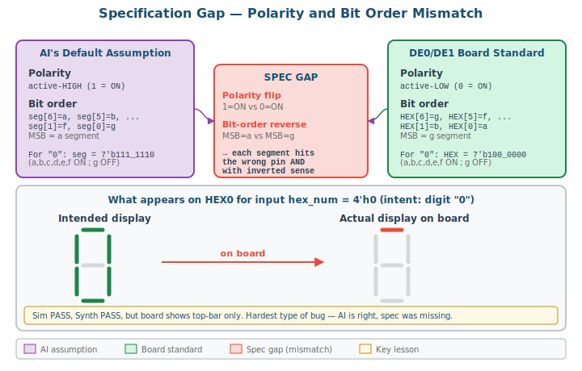
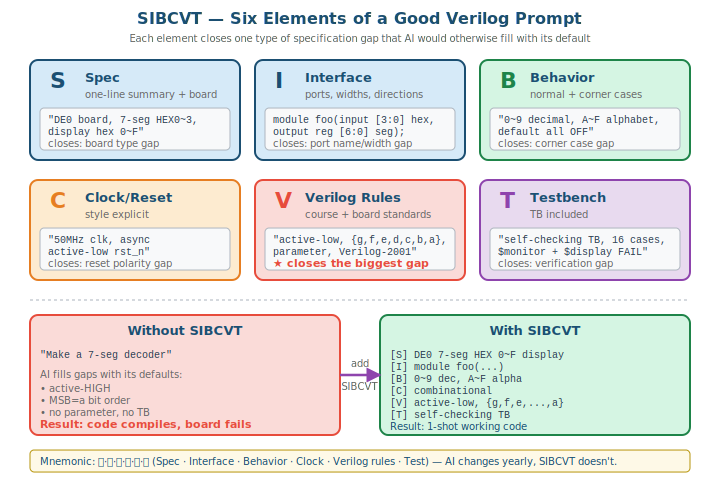
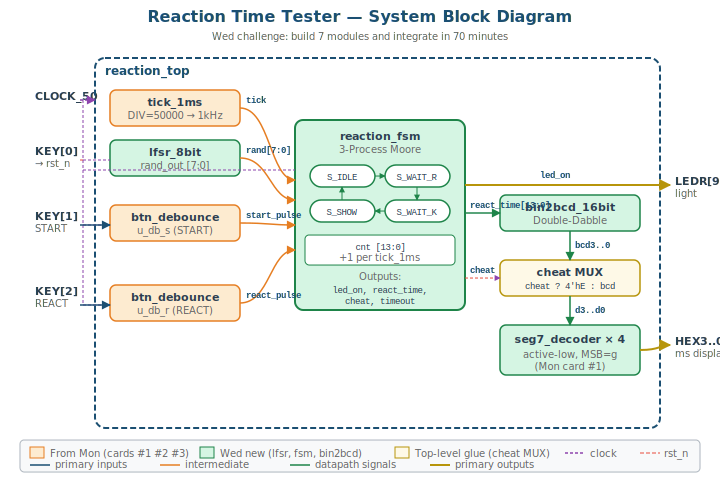

# 11주차: AI 활용 Verilog 코딩 — 프롬프트 학습과 시스템 도전

## 11-1. [Mon] AI 프롬프트 학습 — 5개 모듈 시연

### 학습 목표

- 모던 AI가 만드는 코드의 진짜 함정이 **"명세 공백(specification gap)"**임을 이해한다
- 좋은 Verilog 프롬프트의 6요소(**SIBCVT**)를 익히고 적용할 수 있다
- 나쁜 프롬프트 → 좋은 프롬프트 → 추가 보완의 반복 과정을 체험한다

### 차시 구성

본 차시에서는 5개의 Verilog 모듈을 차례로 다룬다. 매 모듈마다 **나쁜 프롬프트로 받은 결과를 분석**하고, **SIBCVT 6요소를 적용한 좋은 프롬프트로 재요청**한 후, 필요하면 한두 차례 보완 프롬프트를 추가하여 완성도를 높인다.

| # | 모듈 | 학습 포인트 |
|:-:|---|---|
| 카드 #1 | seg7_decoder | SIBCVT 6요소 + active-low + bit order |
| 카드 #2 | btn_debounce | `parameter` vs `localparam`, 2-stage 동기화기 |
| 카드 #3 | tick_1ms (50MHz→1ms) | 단일 클럭 도메인 (별도 clock 생성 금지) |
| 카드 #4 | parking counter | 모듈 분리, 디바운스 통합 |
| 카드 #5 | parking_fsm (만차 검출) | 3-Process Moore + dead code 회피 |

5개 모듈은 **Wed 도전 (반응속도 측정기)에서 모두 재사용**된다.

---

### 0. 도입 — "AI를 잘 쓴다는 것은?"

다음 두 질문을 생각해 보자:

1. ChatGPT, Claude, Gemini 등으로 Verilog 코드를 받아본 적이 있는가?
2. 그 코드를 그대로 Quartus에 넣고 보드에서 동작시켰을 때 **한 번에 동작**한 적이 있는가?

대부분 1번은 경험이 있지만 2번은 그렇지 않다. 왜인가?

> **오늘의 메시지:** 모던 AI는 합성·시뮬레이션 차원의 단순 실수를 거의 안 한다. 그런데도 보드에서 동작하지 않는 이유는 **"명세 공백"** 때문이다. 학생이 명시하지 않은 부분을 AI가 흔한 기본값으로 채우는데, 그 기본값이 학생의 환경과 맞지 않는다.

---

### 1. 카드 #1 — 7-Segment 디코더

**목표:** DE0의 HEX0~HEX3에 hex 0~F를 표시하는 조합논리 디코더

#### Bad 프롬프트

```
7-segment 디코더 만들어줘
```

#### 받은 코드 예시

```verilog
module seg7_decoder (
    input  wire [3:0] hex_num,
    output reg  [6:0] seg
);
    // seg 매핑: seg[6]=a, seg[5]=b, seg[4]=c, seg[3]=d, seg[2]=e, seg[1]=f, seg[0]=g
    always @(*) begin
        case (hex_num)
            4'h0 : seg = 7'b111_1110;
            4'h1 : seg = 7'b011_0000;
            4'h2 : seg = 7'b110_1101;
            // ... A~F
            default : seg = 7'b000_0000;
        endcase
    end
endmodule
```

**합성·시뮬 차원 점검:** `always @(*)` ✅, `case default` ✅, latch 없음 ✅. **완벽해 보인다.**

#### 그러나 DE0 보드에 그대로 올리면?



두 가지 **명시되지 않은 가정**:

1. **Polarity:** `4'h8 = 7'b111_1111` (모두 1) — AI는 **active-high** (1=ON)으로 가정
2. **Bit order:** 주석에 `seg[6]=a, ..., seg[0]=g` — **MSB=a**

**본 강의 표준 (week1, week5):**

- 7-seg는 **active-low** (0=ON)
- `HEX[6:0] = {g, f, e, d, c, b, a}` — **MSB=g**

학생이 `.seg(HEX0)`로 그대로 연결하면, 입력 4'h0 ("0" 표시 의도)일 때 보드에는 **맨 위 가로획 1개만 켜진다.** 4'h8 ("8" 의도)는 **빈 화면.** 모든 디지트가 의미 없는 노이즈가 된다.

> ⚠️ **CRITICAL:** **AI가 잘못한 것이 아니라 학생이 사양을 안 준 것이다.** 합성 통과, 시뮬 통과, 보드에서만 실패 — 가장 디버깅하기 어려운 부류.

#### SIBCVT 6요소 — 명세 공백을 메꾸는 도구



| 약자 | 한글 | 명시 내용 | 7-seg 예시 |
|:---:|---|---|---|
| **S** | 사양 | 한 문장 + 보드 | "DE0의 HEX 4자리에 hex 0~F 표시" |
| **I** | 인터페이스 | 모듈명·포트·비트폭 | `module seg7_decoder(input [3:0] hex, output reg [6:0] seg);` |
| **B** | 동작 | 정상 + 코너 케이스 | "0~9 십진, A~F 알파벳, default 모두 OFF" |
| **C** | 클럭/리셋 | clk·rst 스타일 | "조합논리 (clk/reset 없음)" |
| **V** | 규칙 | 강의·보드 표준 | "active-low (0=ON), `{g,f,e,d,c,b,a}`, Verilog-2001, `case`+`default` 필수" |
| **T** | 검증 | TB 동반 | "self-checking TB, 16 hex 모두 검증" |

> 💡 **TIP:** 외우는 방법: "**시브씨브이티**" 또는 한글 "**사·인·동·시·규·검**". 본 강의의 모든 Verilog 프롬프트에 적용.

#### Good 프롬프트

```
다음 사양으로 7-segment 디코더 모듈을 작성하라.

[S] DE0(Cyclone III) 보드의 HEX0~HEX3 7-seg에 hex 0~F를 표시하는
    조합논리 디코더.
[I] module seg7_decoder(
        input  [3:0] hex,
        output reg [6:0] seg
    );
    seg는 {g, f, e, d, c, b, a} 순서 (MSB=g).
[B] hex 0~9: 십진수 그대로 표시.
    hex A~F: 'A','b','C','d','E','F' (대소문자 혼용 정상).
    default: 모든 세그먼트 OFF.
[C] 조합논리만 사용 (clk/reset 없음).
[V] 7-seg는 active-low: 켜려면 0, 끄려면 1.
    Verilog-2001 스타일.
    always @(*) + case + default 필수.
[T] self-checking testbench: 16개 hex 값 모두 검증, $monitor 출력.
```

#### 예상 결과

active-low + `{g,f,e,d,c,b,a}` 순서가 명시된 깨끗한 디코더가 나온다. ModelSim에서 `4'h0` → `7'b1000000` (= g만 OFF, 나머지 ON)이 나와야 정답이다.

카드 #1은 **1회 SIBCVT 적용으로 완성**되는 단순한 사례이다. 다음 카드들은 더 복잡한 명세 공백을 다룬다.

---

### 2. 카드 #2 — btn_debounce

**목표:** KEY 입력의 채터링을 제거하고 1-clk pulse를 출력하는 디바운스 모듈

#### Bad 프롬프트

```
버튼 채터링 없애는 디바운스 회로 만들어줘. 출력은 1-clock pulse.
```

#### 받은 코드의 흔한 결함 패턴

```verilog
module btn_debounce(
    input clk, btn,
    output pulse
);
    localparam CNT_MAX = 20'd1_000_000;   // ← localparam!
    reg [19:0] cnt;
    reg btn_sync;
    // 1-stage sync만 사용 (메타스테이블 위험)
    // edge 검출 방향 미명시
    ...
endmodule
```

#### 명세 공백 4가지

1. **`localparam`** → testbench에서 `defparam` / `#()` 으로 **오버라이드 불가**. 시뮬에서 20ms 디바운스를 그대로 기다리면 **수백만 cycle** 시뮬 시간 소요.
2. **클럭 주파수 미명시** — 50MHz인지 25MHz인지 모름.
3. **2-stage 동기화기 누락** — KEY가 비동기 입력이므로 메타스테이블 위험.
4. **Falling vs rising edge** — KEY는 active-low (눌렀을 때 0), 일반적으로 falling edge 검출 필요.

#### Good 프롬프트

```
다음 사양으로 버튼 디바운스 모듈을 작성하라.

[S] DE0/DE1 KEY 디바운스. 채터링 제거 후 1-clk pulse 출력.
[I] module btn_debounce #(
        parameter DEBOUNCE_CNT = 1_000_000   // 50MHz에서 20ms
    ) (
        input  clk, rst_n,
        input  btn_in,        // KEY 입력 (active-low)
        output reg btn_pulse  // 1-clk pulse on stable falling edge
    );
[B] btn_in이 DEBOUNCE_CNT cycle 동안 안정 LOW로 유지되면 1-clk pulse 발생.
    중간에 채터링(HIGH 복귀) 발생 시 카운터 리셋.
    한 번 누름 = 한 번 pulse (재트리거 방지).
[C] 50MHz clk, async active-low rst_n.
[V] **parameter** 사용 (localparam 아님 — testbench에서 짧은 값으로 override 필수).
    2-stage 동기화기로 메타스테이블 방지.
    3-process FSM 패턴 권장 (IDLE → COUNTING → FIRE).
    Verilog-2001, 모든 reg는 reset 분기에서 초기화.
[T] testbench에서 DEBOUNCE_CNT=10으로 override.
    채터링 시나리오: btn 안정 LOW 5cycle → HIGH → LOW (chatter), 그리고
    안정 LOW 15cycle (clean press) 두 케이스 검증.
```

#### 보완 프롬프트 (필요시)

AI 응답에 **2-stage 동기화기가 누락**되어 있으면 다음으로 추가 요청:

```
위 코드에 2-stage 메타스테이블 방지 동기화기를 추가하라:
reg btn_sync1, btn_sync2;
btn_sync1 <= btn_in;
btn_sync2 <= btn_sync1;
내부 로직은 btn_sync2 사용.
```

> 💡 **TIP:** **`parameter` vs `localparam`은 본 강의에서 가장 자주 발견되는 명세 공백**이다. AI는 기본적으로 `localparam`을 만든다 (변경 의도 없다고 가정). 시뮬레이션 가능한 코드를 원하면 항상 명시.

---

### 3. 카드 #3 — tick_1ms (50MHz → 1ms enable)

**목표:** 50MHz 클럭에서 1ms 주기로 1-clk pulse 발생

#### Bad 프롬프트

```
50MHz 클럭을 1ms 주기로 만드는 회로 만들어줘.
```

#### 받은 코드의 매우 위험한 패턴

```verilog
module tick_1ms(input clk_50mhz, output reg clk_1ms);
    reg [15:0] cnt;
    always @(posedge clk_50mhz) begin
        if (cnt == 50000-1) begin
            cnt <= 0;
            clk_1ms <= ~clk_1ms;   // ← 별도 clock 생성!
        end else
            cnt <= cnt + 1;
    end
endmodule
```

이후 학생이 다음과 같이 사용 시도할 가능성이 높다:

```verilog
always @(posedge clk_1ms) begin   // ← 별도 clock domain!
    counter <= counter + 1;
end
```

#### 명세 공백

1. **별도 clock 신호 생성** — `clk_1ms`를 새로운 clock domain으로 만듦
2. Quartus가 `clk_1ms`를 자동 routing할 때 GCLK 자원이 안 갈 수 있음 → **skew 문제**
3. 메인 clock과 새 clock 사이의 **CDC (clock domain crossing)** 처리 안 됨
4. **bit-width 부족** — 50000을 카운트하려면 16-bit 필요한데 모자랄 수도

**올바른 해법:** 별도 clock을 만들지 말고 **enable pulse**만 생성한다.

#### Good 프롬프트

```
다음 사양으로 1ms tick generator를 작성하라.

[S] 50MHz 단일 클럭에서 1ms 주기로 1-clk 길이 enable pulse 발생.
[I] module tick_1ms #(
        parameter DIV = 50_000      // 50MHz / 50000 = 1kHz = 1ms
    ) (
        input  clk, rst_n,
        output reg tick             // 1-clk pulse at 1ms interval
    );
[B] DIV-1 cycle마다 1-clk 동안 tick=1, 그 외에는 tick=0.
[C] 50MHz clk, async active-low rst_n. reset 시 counter=0, tick=0.
[V] **별도 clock 신호 생성 금지** (multi-clock domain 회피).
    단일 clk만 사용, 출력은 enable pulse.
    counter bit-width 충분히 ($clog2(DIV) 이상, 안전하게 17-bit).
    parameter DIV로 testbench에서 짧은 값으로 override 가능.
    Verilog-2001, 모든 reg reset 초기화.
[T] testbench에서 DIV=10으로 override.
    10 cycle마다 tick=1이 1 cycle 동안만 발생함을 검증.
```

#### 사용 측 패턴

```verilog
always @(posedge clk) begin
    if (tick) counter_1ms <= counter_1ms + 1;
end
```

> ⚠️ **WARNING:** **카드 #3의 함정이 가장 깊다.** AI가 만든 코드가 시뮬에서는 동작하고 합성도 통과하지만, **실제 보드에서 GCLK skew로 random failure**가 발생한다. 학생이 "AI 코드가 시뮬은 되는데 보드만 가면 안 됨"이라고 호소하는 사례의 절반은 이 함정이다.

> 💡 **TIP:** "**단일 clock domain**"은 FPGA 설계의 절대 원칙 중 하나. 1ms든 1Hz든 별도 clock을 만들지 말고 enable pulse로. Wed 도전에서 `tick_1ms`를 그대로 재사용한다.

---

### 4. 카드 #4 — parking counter

**목표:** 입차/출차 pulse를 받아 차량 수를 카운트하는 모듈

#### Bad 프롬프트

```
주차장에 들어오고 나가는 차량을 카운트하는 Verilog 모듈 만들어줘.
들어오면 +1, 나가면 -1.
```

#### 받은 코드의 흔한 결함 패턴

```verilog
module parking_counter(
    input clk, rst,
    input enter, exit,
    output reg [7:0] count
);
    always @(posedge clk) begin
        if (rst) count <= 0;
        else if (enter) count <= count + 1;     // KEY 직접 사용!
        else if (exit)  count <= count - 1;
    end
endmodule
```

#### 명세 공백 5가지

1. **`enter`, `exit`가 KEY 직접인지 pulse인지 미명시** — KEY를 직접 받으면 채터링으로 한 번 누름이 수십 카운트
2. **`rst`가 sync vs async, active-high vs low** 미명시
3. **`count`의 bit-width 임의** — 8-bit인데 max capacity 명시 없음
4. **Overflow/Underflow** 처리 없음 — `count == 0`에서 -1 하면 255로 wrap
5. **enter와 exit 동시 입력 시** 동작 미정

#### Good 프롬프트

```
다음 사양으로 주차장 카운트 모듈을 작성하라.

[S] DE0 보드용 주차장 차량 카운터.
    외부 디바운스 모듈에서 입차/출차 pulse를 받음.
[I] module parking_counter(
        input        clk,                 // 50MHz
        input        rst_n,               // KEY[0], async active-low
        input        enter_pulse,         // 1-clk pulse (debounced)
        input        exit_pulse,          // 1-clk pulse (debounced)
        input  [4:0] capacity,            // SW[4:0], max 31
        output reg [4:0] count,
        output       full
    );
[B] enter_pulse=1 시 count+1 (단, count<capacity).
    exit_pulse=1 시 count-1 (단, count>0).
    count==capacity 시 full=1.
    enter_pulse, exit_pulse 동시 입력 시 count 변경 없음 (상쇄).
    reset 시 count=0.
[C] 50MHz clk, async active-low rst_n.
[V] 본 모듈은 디바운스 미포함 — pulse 입력 가정.
    Verilog-2001, non-blocking 사용, 모든 reg 초기화.
    full은 assign문으로.
[T] testbench: capacity=4'd5로 입차 7회(2회는 무시), 출차 8회(3회는 무시) 검증.
```

#### 보완 프롬프트 (필요시)

AI가 enter/exit 동시 입력 처리를 빼먹은 경우:

```
위 코드에서 enter_pulse와 exit_pulse가 같은 cycle에 1이 되면
count 변경이 없도록 명시적으로 처리하라:
if (enter_pulse && !exit_pulse && (count < capacity))      count <= count + 1;
else if (!enter_pulse && exit_pulse && (count > 0))         count <= count - 1;
// else: hold
```

> 💡 **TIP:** **"모듈 책임 분리"**를 프롬프트에서 명시하면 통합이 깔끔해진다. 디바운스는 별도 모듈, 카운터는 카운터만, FSM은 FSM만. 카드 #2와 카드 #4가 합쳐져서 Wed에서 동작한다.

---

### 5. 카드 #5 — parking_fsm (만차 검출)

**목표:** 만차 상태를 관리하는 3-process Moore FSM

#### Bad 프롬프트

```
주차장 만차 상태를 FSM으로 관리하는 Verilog 모듈 만들어줘.
```

#### 받은 코드의 흔한 결함 — "2.5-Process Pattern"

이 패턴은 12조 미니 프로젝트에서 실제로 관찰되었다.

```verilog
module parking_fsm(...);
    localparam S_NORMAL = 1'b0;
    localparam S_FULL   = 1'b1;
    reg state, next_state;

    always @(posedge clk or negedge rst_n)
        if (!rst_n) state <= S_NORMAL;
        else        state <= next_state;

    always @(*) begin
        next_state = state;
        case (state)
            S_NORMAL: if (count >= capacity) next_state = S_FULL;
            S_FULL:   if (count <  capacity) next_state = S_NORMAL;
        endcase
    end

    assign full = (count >= capacity);   // ← state 미사용!
endmodule
```

#### 합성 시 무슨 일이 일어나는가

Quartus는 `state` 레지스터가 출력에 영향을 안 준다고 판단하여 **dead code로 자동 제거**한다:

```
Info (276003): Removing register "state[0]" because it is not used
```

**FSM이 합성 후 사라진다.** 보고서에서 "3-Process Pattern 사용"이라고 주장하면 **거짓 주장**이 된다.

#### Good 프롬프트

```
다음 사양으로 주차장 만차 검출 FSM을 작성하라.

[S] count와 capacity를 비교하여 만차 상태를 관리하는 FSM.
[I] module parking_fsm(
        input        clk, rst_n,
        input  [4:0] count, capacity,
        output reg   full
    );
[B] count >= capacity 시 S_FULL 상태로 천이, full=1.
    count <  capacity 시 S_NORMAL 상태로 천이, full=0.
[C] 50MHz clk, async active-low rst_n. reset 시 S_NORMAL.
[V] **반드시 3-Process Moore FSM**:
      P1: state register (sequential)
      P2: next state logic (combinational, always @(*) + case + default)
      P3: output logic (combinational, always @(*) + case + default)
    출력 full은 **반드시 P3에서 state를 case로 분기하여 결정**.
    `assign full = (count >= capacity)` 같은 state 우회 금지 — 합성 시 dead code됨.
    state 인코딩은 localparam, 2개 상태 사용.
[T] testbench: capacity=5에서 count 0→4→5→4→6→0 변화 시 full 신호 확인.
```

#### 예상 결과 (P3 부분)

```verilog
always @(*) begin
    case (state)
        S_NORMAL: full = 1'b0;
        S_FULL:   full = 1'b1;
        default:  full = 1'b0;
    endcase
end
```

> ⚠️ **WARNING:** **카드 #5의 함정은 "구조적으로는 옳지만 의미적으로는 잘못"인 가장 어려운 부류**다. 합성·시뮬·테스트 모두 통과하고 보드에서도 동작한다 — 단지 보고서의 "FSM 사용" 주장이 거짓이 된다. 이런 함정은 **체크리스트만으로는 잡기 어렵고 코드 리뷰가 필요**하다.

> 💡 **TIP:** **"3-Process Moore + state-based output"**을 프롬프트에서 명시. 이 한 줄이 12조의 실수를 막는다. Wed에서 같은 패턴으로 더 큰 FSM(반응속도 측정기의 메인 FSM)을 만든다.

---

### 6. 종합 매트릭스

| 카드 | 모듈 | 핵심 명세 공백 | 결정적 SIBCVT 요소 |
|:-:|---|---|:---:|
| #1 | seg7_decoder | active-high, bit order | **[V]** |
| #2 | btn_debounce | localparam, sync | **[V]+[I]** |
| #3 | tick_1ms | 별도 clock 생성 | **[V]** |
| #4 | parking_counter | KEY 직접, overflow | **[B]+[I]** |
| #5 | parking_fsm | dead code (2.5-process) | **[V]** |

#### 핵심 메시지 3가지

1. **AI는 매년 바뀌지만 SIBCVT는 불변** — 좋은 사양서를 쓰는 능력
2. **명세 공백은 학생 책임** — AI가 잘못한 것이 아니라 사양이 부족한 것
3. **검증 능력 (1~10주 손코딩 학기)이 있어야 명세 공백을 인지 가능** — AI는 사양 외에 어디가 비었는지 모른다

---

### 7. Wed 도전 예고

**도전 사양:** DE0 보드용 반응속도 측정기

- KEY[1] START → 무작위 0.5~2.5초 대기 → LEDR[9] ON → KEY[2] REACT
- 반응시간(ms 단위)을 4자리 7-seg에 표시
- 너무 빨리 누르면 "cheat" 감지

**필요 모듈 (오늘 5 카드의 4개 직접 재사용 + 신규 3개):**

| 모듈 | 출처 |
|---|---|
| `seg7_decoder` | Mon 카드 #1 |
| `btn_debounce` | Mon 카드 #2 (×2 인스턴스) |
| `tick_1ms` | Mon 카드 #3 |
| `lfsr_8bit` | Wed 신규 (week7 LFSR 응용) |
| `reaction_fsm` | Wed 신규 (카드 #5 패턴 확장) |
| `bin2bcd_16bit` | Wed 신규 |
| `reaction_top` | Wed 신규 (DE0 wrapper) |

> 💡 **TIP:** 오늘 받은 5개 카드의 최종 Verilog 코드를 **이번 주말까지 자기 노트북에 정리해 두기**. Wed 도전에서 그대로 import한다.

---

## 11-2. [Wed] 도전 — 반응속도 측정기 팀 작업

### 학습 목표

- 3명 팀으로 역할을 분담하여 70분 안에 시스템 하나를 통합·검증한다
- 사전에 합의된 인터페이스에 따라 모듈을 만들고, 충돌 없이 결합한다
- 본인이 담당한 부분의 책임을 지고, 통합·디버깅을 팀과 협업한다

### 팀 구성 — 3명

본 강의의 9~10주 미니 프로젝트 조 그대로 유지. 각 조는 다음 역할로 구성:

| 역할 | 인원 | 책임 |
|:---:|:---:|---|
| **Integrator** | 1명 | top.v / 핀 할당 / Quartus 프로젝트 / 합성 / 보드 검증 |
| **Coder** | 2명 | AI 코딩으로 신규 모듈 3개 생성 + Testbench 시뮬 |

> 💡 **TIP:** 9~10주 미니 프로젝트에서 합성·핀 할당을 주도한 학생이 Integrator를 맡으면 자연스럽다.

### 사전 배포 — `wed_team_starter/` 폴더

강의 1주 전 LMS에 다음 폴더가 배포된다:

```
wed_team_starter/
├── README.md                ← 팀 작업 안내
├── SETUP.md                 ← Integrator용 사전 준비 가이드
├── INTERFACE.md             ← Coder용 인터페이스 명세
├── reaction_top.v           ← top wrapper 완성판 (사전 배포)
├── reaction_pins_de0.qsf    ← DE0 핀 할당 (사전 배포)
├── seg7_decoder.v           ← Mon 카드 #1 표준 결과
├── btn_debounce.v           ← Mon 카드 #2 표준 결과
├── tick_1ms.v               ← Mon 카드 #3 표준 결과
└── run.do                   ← ModelSim 자동 실행
```

**Integrator는 강의 전에 `SETUP.md`에 따라 환경 셋업을 완료해야 한다** — 약 30분 소요. Quartus 13 새 프로젝트 생성, 4개 .v 파일 add, 핀 할당 import, Analysis & Synthesis로 환경 검증. 강의 당일 0:00부터 통합·시뮬에 즉시 진입할 수 있도록.

**Coder는 강의 전에 `INTERFACE.md`를 읽어둔다** — 3개 신규 모듈의 정확한 port 사양이 들어있다. 강의 당일 본인 AI에 SIBCVT 프롬프트로 입력할 때 [I] Interface 섹션에 그대로 복사한다.

### 1. 도전 사양

#### 1.1 동작 시나리오

```
1. 초기 상태: LEDR[9]=OFF, HEX=0000
2. 사용자가 KEY[1] (START) 누름
3. 0.5~2.5초 무작위 대기 (이 동안 KEY[2] 누르면 CHEAT 감지)
4. LEDR[9]=ON, 동시에 내부 ms 카운터 시작
5. 사용자가 KEY[2] (REACT) 누름 → 카운터 정지
6. 반응시간(ms)을 4자리 BCD로 HEX3..HEX0에 표시
   - 정상: "0234" (234 ms)
   - 너무 빨리(cheat): "EEEE"
   - 타임아웃(9999ms 초과): "9999"
7. 다시 KEY[1] 누르면 1단계로
```

#### 1.2 성공 기준 (계층적)

| 단계 | 기준 | 목표 |
|---|---|---|
| 최소 | 모듈 7개 컴파일 통과 | 모든 팀 |
| 기본 | ModelSim 정상 시나리오 PASS | **80% 팀 (★ 본 도전 기본 목표)** |
| 추가 | CHEAT 시나리오 PASS | 60% |
| 보너스 | Quartus 합성 통과 | 40% |
| 더 보너스 | DE0 보드 실제 동작 | 20% |

> **본 도전의 본질은 보드 다운로드가 아니라 ModelSim PASS다.** 팀이 AI 도구로 시스템 하나를 통합·검증하는 경험을 체득하면 성공이다.

---

### 2. 시스템 구성



시스템은 7개 모듈로 구성된다. 사전 배포된 4개와 강의 중 작성하는 3개:

| 모듈 | 사전 배포? | 작성자 | 역할 |
|---|:---:|---|---|
| `reaction_top.v` | ✅ | (사전 배포) | DE0 wrapper, 모든 모듈 인스턴스화 |
| `seg7_decoder.v` | ✅ | (Mon 결과) | 4-bit hex → 7-seg active-low |
| `btn_debounce.v` | ✅ | (Mon 결과) | KEY 디바운스 + 1-clk pulse |
| `tick_1ms.v` | ✅ | (Mon 결과) | 1ms enable pulse |
| `lfsr_8bit.v` | ❌ | **Coder** | 8-bit LFSR — random delay 생성 |
| `reaction_fsm.v` | ❌ | **Coder** | 4-state Moore FSM — 메인 컨트롤러 |
| `bin2bcd_16bit.v` | ❌ | **Coder** | Double-Dabble BCD 변환 |

Coder는 위 3개를 AI로 생성한다. Integrator는 사전 배포된 4개를 그대로 사용한다.

---

### 3. 인터페이스 합의

Coder가 만들 3개 모듈의 port 사양은 `INTERFACE.md`에 명시되어 있다. Coder는 이 사양에 따라 모듈을 만들고, Integrator의 `reaction_top.v`는 이미 같은 사양에 맞춰 작성되어 있다 — **사전 합의된 인터페이스**.

### 3.1 `lfsr_8bit` 인터페이스

```verilog
module lfsr_8bit #(
    parameter [7:0] SEED = 8'hA5
)(
    input            clk,
    input            rst_n,
    input            enable,
    output reg [7:0] rand_out
);
```

### 3.2 `reaction_fsm` 인터페이스

```verilog
module reaction_fsm(
    input             clk,
    input             rst_n,
    input             tick_1ms,
    input             start_pulse,
    input             react_pulse,
    input      [13:0] random_delay,
    output reg        led_on,
    output reg [13:0] react_time,
    output reg        cheat,
    output reg        timeout
);
```

### 3.3 `bin2bcd_16bit` 인터페이스

```verilog
module bin2bcd_16bit(
    input      [13:0] bin,
    output reg [3:0]  bcd3,
    output reg [3:0]  bcd2,
    output reg [3:0]  bcd1,
    output reg [3:0]  bcd0
);
```

자세한 동작 사양과 SIBCVT 프롬프트 권장 형태는 `INTERFACE.md` 참조.

---

### 4. Coder 자율 분배 패턴

3개 모듈을 Coder 2명이 나눠 맡되, 강제하지 않는다. 다음 패턴 중 선택:

**패턴 A — 단순 분배 (1:2)**
- Coder 1: `lfsr_8bit` + `bin2bcd_16bit` (단순 2개)
- Coder 2: `reaction_fsm` (복잡 1개)

**패턴 B — 짝 코딩**
- 두 사람이 `reaction_fsm`을 함께 작성 (가장 어려운 부분)
- 끝나면 한 사람은 `lfsr`, 다른 사람은 `bin2bcd`

**패턴 C — Testbench 분담**
- Coder 1: `lfsr_8bit` + `bin2bcd_16bit` 작성
- Coder 2: `reaction_fsm` + 전체 testbench 작성

조 내에서 토론해서 결정. Mon 카드 결과를 잘 만든 사람이 본인 강점 영역을 맡는 것이 자연스럽다.

---

### 5. Phase별 작업

각 phase의 시간 배분과 운영은 `week11_guide.md` (강의자 가이드) 참조. 학생 입장에서 각 phase의 핵심 활동은 다음과 같다.

### 5.1 Phase 0 — 도전 시작 (0:00 ~ 0:10)

- 도전 사양 함께 듣기
- `INTERFACE.md` 함께 읽기, 역할 분배 합의
- 통합 마감 시간 합의 (0:25까지 본인 모듈 완성)

### 5.2 Phase 1 — 병렬 작업 (0:10 ~ 0:25)

**Integrator:**
- ModelSim sim 폴더 준비
- testbench 시나리오 설계 (정상 + cheat 시나리오)
- Coder들에게 인터페이스 재확인

**Coder × 2:**
- 본인 담당 모듈 AI 생성 (`INTERFACE.md`의 SIBCVT 프롬프트 사용)
- 본인 모듈 단독 컴파일 통과 확인
- (시간 여유 시) 단독 testbench 작성

### 5.3 Phase 2 — 통합 + ModelSim (0:25 ~ 0:50)

- Coder가 만든 3개 모듈을 Integrator에게 전달
- Integrator가 Quartus 프로젝트에 add (Add/Remove Files in Project)
- 전체 testbench (`reaction_top_tb.v`) 작성 — Coder 중 한 명이 AI로 생성
- ModelSim 시뮬 실행: `vsim -do "do run.do"`
- 파형 분석, 디버깅

### 5.4 Phase 3 — 합성 + 보드 (0:50 ~ 1:00)

- Quartus Full Compilation 실행
- Compilation Report 분석 (LE, Fmax)
- (보너스) DE0 보드 다운로드 + 시연

### 5.5 Phase 4 — 시연 + 회고 (1:00 ~ 1:10)

- 팀 시연: ModelSim 파형 또는 보드 동작
- 회고: 가장 막혔던 부분, AI 활용 경험, 인터페이스 합의의 효과

---

### 6. 통합 시 자주 발생하는 문제

| 증상 | 원인 | 해결 |
|---|---|---|
| 합성 시 "module not found" | Coder 모듈을 프로젝트에 add 안 함 | Project → Add/Remove Files |
| 합성 경고 "width mismatch" | INTERFACE 명세 위반 (비트 폭) | INTERFACE.md 재확인, Coder 수정 |
| ModelSim에서 X 값 propagation | reg 초기화 누락 | reset 분기에서 모든 reg 명시 |
| LEDR[9] 안 켜짐 | `reaction_fsm`의 led_on 출력 미생성 | P3 output logic 확인 |
| HEX = EEEE 항상 표시 | cheat 신호가 stuck | `reaction_fsm`의 cheat reset 확인 |
| 합성 통과인데 시뮬에서 결과 이상 | parameter override 누락 | TB의 defparam 확인 |

---

### 7. 평가 기준

| 항목 | 비중 | 평가 대상 |
|---|:---:|---|
| 시스템 동작 (ModelSim PASS) | 40% | 팀 |
| 본인 역할 수행도 | 30% | **개인** |
| 발표 시 본인 부분 설명 | 20% | **개인** |
| 협업·인터페이스 합의 품질 | 10% | 팀 |

**Integrator 개인 평가:** Quartus 프로젝트 완성도, 통합 시 mismatch 해결, 합성 결과 분석.

**Coder 개인 평가:** AI 프롬프트 SIBCVT 적용, 생성 모듈 정확도, 단독 TB 작성.

---

### 8. 강의 종합

여러분이 70분 안에 팀으로 만든 반응속도 측정기는:

- 7개 모듈
- FSM 1개, 카운터 2개, 디바운스 2개
- 4자리 7-seg 디스플레이
- 약 300~400 라인의 Verilog

**이걸 혼자 손코딩으로 했다면 며칠** 걸렸을 작업이다. 그러나 검증·통합·디버깅은 결국 손코딩 1~10주의 hardware-aware 사고가 있어야 가능했다. 그리고 **팀 협업**이 있었기에 70분 안에 가능했다.

> **AI는 망치, 검증 능력은 눈, 팀워크는 손발** — 셋 다 있어야 시스템이 완성된다.

#### 다음 차시 (회3) 예고

다음 주 Mon (회3)부터는 **세 번째 도구 — Model-Based Design (Simulink HDL Coder)**.
PID 컨트롤러를 Simulink로 그리면 Verilog가 자동 생성된다. 손코딩·AI 코딩·MBD 3자의 적합 영역을 비교한다.

---

### 과제 (1주일 내 제출, 5점, 개인)

다음 중 하나 선택:

**과제 옵션 1 — 본인 모듈 심화**

본인이 강의에서 담당한 모듈에 대해:
- 사용한 SIBCVT 프롬프트 (6요소 모두 명시)
- AI 응답에서 채택한 부분과 수정한 부분
- 단독 testbench + 시뮬 파형 캡처
- 합성 결과 (해당 모듈만 — module-level Quartus 합성)

**과제 옵션 2 — 통합 후 합성·보드 (Integrator 추천)**

강의 중 ModelSim PASS까지만 갔으면:
- Quartus 합성 통과 + Compilation Report 첨부
- (가능하면) DE0 보드 다운로드 + 시연 영상

**과제 옵션 3 — 확장 도전 (팀 합의 가능)**

반응속도 측정기에 추가 기능 1개 구현:
- 최고기록 저장
- 부저 추가 (LEDR[9] 점등 시 짧은 beep)
- 3회 평균 모드

제출물: 확장 코드 + 시뮬 영상 + 본인 기여 설명.

---
