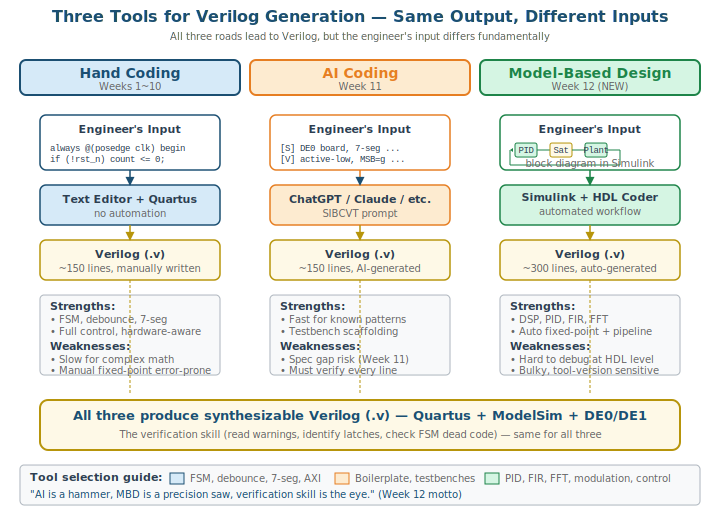
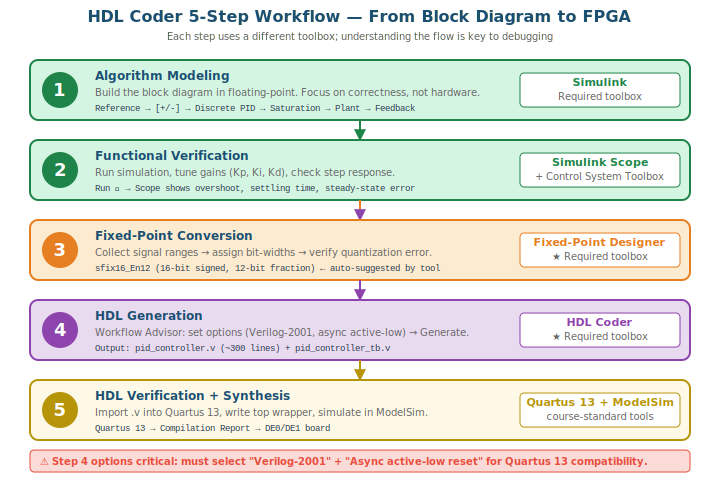
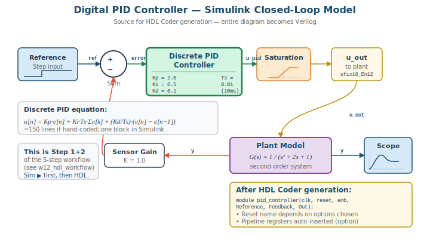

# 12주차: Model-Based Design — Simulink HDL Coder로 PID 컨트롤러 만들기

## 12-0. 사전 준비 — MATLAB Toolbox 설치 확인

본 주차부터는 MATLAB/Simulink를 사용한다. 학교 라이선스가 있더라도 **각자 노트북에 필요한 toolbox가 설치되었는지** 사전 확인이 필수다.

### 설치 확인 방법

MATLAB 실행 후 Command Window에서:

```matlab
ver
```

출력 목록에서 다음 항목이 모두 표시되는지 확인한다.

### 최소 필수 (4개) — 설치 안 됨 시 강의 진행 불가

| Toolbox | 역할 | 본 강의에서 |
|---|---|---|
| **MATLAB** | 기본 환경 | 모든 작업의 베이스 |
| **Simulink** | 블록 다이어그램 모델링 | PID 블록도 작성 |
| **HDL Coder** | Simulink → Verilog 자동 생성 | 핵심 기능 |
| **Fixed-Point Designer** | float→fixed 변환, 비트폭 자동 결정 | HDL 생성 전 필수 단계 |

### 강력 권장 (2개) — 없어도 진행은 가능하나 데모 일부 제한

| Toolbox | 역할 | 본 강의에서 |
|---|---|---|
| **Simulink Control Design** | PID Tuner (자동 튜닝) | Mon 데모의 게인 자동 조정 |
| **Control System Toolbox** | Transfer function, plant 모델링 | Mon 데모의 closed-loop |

### 선택 — 본 강의 외 응용

- **HDL Verifier** — Simulink와 외부 HDL 시뮬레이터(ModelSim) 공동 시뮬. 본 강의는 ModelSim을 별도 실행하므로 필수 아님
- **DSP HDL Toolbox** — FIR, FFT 등 산업 사례용. 회5에서 언급만 함
- **Deep Learning HDL Toolbox** — CNN을 FPGA에 배포. 회5에서 개념만 소개

### 설치가 안 되어 있다면

학교 라이선스 매니저 또는 IT 부서에 문의:

1. 사용 중인 MATLAB 버전 확인 (R2022a 이상 권장)
2. 위 6개 toolbox에 대한 학내 라이선스 가용 여부 확인
3. MathWorks Add-On Explorer 또는 학교 배포 패키지로 설치

> ⚠️ **WARNING:** **MATLAB 라이선스가 점유 중이면 도구 자체가 안 열린다.** 강의 시간에 일제히 사용하면 라이선스 부족 가능. 학내 라이선스 동시 사용자 수가 충분한지 사전 확인.

### 본 강의 환경 정보 재확인

- **합성 도구:** Quartus Prime 13 (Cyclone III/II 지원)
- **시뮬레이션:** ModelSim Altera Starter Edition 10.1d
- **보드:** DE0 (EP3C16F484C6) 또는 DE1 (EP2C20F484C7)
- **MATLAB 버전:** R2022a 이상 권장 (이보다 낮으면 일부 옵션 위치가 다를 수 있음)

> 📝 **NOTE:** HDL Coder는 신형 합성 도구(Vivado, Quartus Pro)를 가정한 옵션이 많다. 본 강의는 구형 Quartus 13을 쓰므로 일부 옵션을 수동 조정해야 한다 (12주 Mon 섹션 2.2에서 상세 안내).

---

## 12-1. [Mon] Simulink HDL Coder 입문 + PID 데모

### 학습 목표

- Model-Based Design(MBD)의 개념과 HDL Coder의 동작 원리를 설명할 수 있다
- 디지털 PID 컨트롤러를 Simulink에서 fixed-point로 모델링하는 흐름을 이해한다
- 손코딩 / AI 코딩 / MBD 자동생성의 적합 영역을 구분할 수 있다

### 11주와의 연결

지난주 우리는 **두 번째 도구 — AI 코딩**을 배웠다. SIBCVT 프롬프트로 5개 모듈을 만들고, 시스템 하나(반응속도 측정기)를 70분에 완성했다.

이번 주는 **세 번째 도구 — Model-Based Design (MBD)**이다:

| 도구 | 출처 | 학생 입력 | AI/도구 출력 |
|:---:|---|---|---|
| 손코딩 | 1~10주 | Verilog 직접 작성 | (없음 — 본인이 직접) |
| AI 코딩 | 11주 | SIBCVT 프롬프트 | Verilog 코드 |
| **MBD** | **12주** | **Simulink 블록도** | **Verilog 코드** |

세 도구 모두 **최종 산출물은 Verilog**이다. 그러나 학생이 무엇을 하느냐가 다르다.



---

### 1. Model-Based Design 개념

#### 1.1 두 가지 사고방식

| Hardware-aware 사고 (1~10주) | Algorithm-first 사고 (MBD) |
|---|---|
| "이걸 회로로 어떻게 만들지?" | "이 알고리즘이 맞는가?" |
| Verilog로 시작 | 수학·블록도로 시작 |
| 합성·타이밍 먼저 고민 | 기능·정확도 먼저 검증 |
| FSM, datapath 분리 설계 | 시스템 수준 검증 |
| 손코딩 단위에 강함 | 대규모·복잡 알고리즘에 강함 |

둘 다 필요하다. 본 강의가 길러준 hardware-aware 사고는 MBD가 만든 코드를 **검증·최적화**하는 데 필수이다. MBD만 알면 "왜 latch가 들어가나?", "왜 Fmax가 안 나오나?"를 답할 수 없다.

#### 1.2 산업별 MBD 도입 현황

| 분야 | MBD 비중 | 주된 도구 |
|---|:---:|---|
| 항공·국방 (DO-178C, DO-254) | ★★★★★ | Simulink + HDL Coder |
| 자동차 (ASPICE, ISO 26262) | ★★★★★ | Simulink + Embedded Coder |
| 통신 baseband (5G, NB-IoT) | ★★★★ | Simulink + HDL Coder |
| **제어로봇** | ★★★★ | **Simulink + HDL Coder** ← 본 강의 |
| 일반 디지털 설계 (CPU 등) | ★★ | 손코딩 위주 |

> 💡 **TIP:** 통신·제어 분야에서 **알고리즘 검증이 끝난 Simulink 모델을 그대로 HDL로 가져갈 수 있느냐**가 개발 일정의 절반을 좌우한다. MBD를 모르면 "Matlab에서 동작했는데 FPGA에서 안 됨"이라는 디버깅 지옥에 빠진다.

#### 1.3 도구 스택

```
┌────────────────────────────────────────┐
│  Simulink                              │
│   - 블록 다이어그램으로 알고리즘 표현  │
│   - Floating-point 시뮬                │
└────────────┬───────────────────────────┘
             │
┌────────────┴───────────────────────────┐
│  Fixed-Point Designer                  │
│   - 비트 폭 자동 결정                  │
│   - 양자화 오차 분석                   │
│   - Float vs Fixed 결과 비교           │
└────────────┬───────────────────────────┘
             │
┌────────────┴───────────────────────────┐
│  HDL Coder                             │
│   - Verilog 또는 VHDL 자동 생성        │
│   - Pipeline / clock gating 옵션       │
│   - Testbench 함께 생성                │
└────────────┬───────────────────────────┘
             │
       ┌─────┴──────┐
       │ Quartus 13 │
       │  ModelSim  │
       │  DE0/DE1   │
       └────────────┘
```

---

### 2. HDL Coder Workflow

#### 2.1 5단계 워크플로우



1. **Algorithm modeling** — Simulink에서 floating-point 블록도 구성
2. **Functional verification** — 입력에 대한 출력이 의도대로 나오는지 검증
3. **Fixed-point conversion** — Fixed-Point Tool로 비트 폭 결정
4. **HDL generation** — Workflow Advisor에서 Verilog 생성
5. **HDL verification** — 생성된 HDL을 ModelSim에서 다시 검증

#### 2.2 Workflow Advisor 핵심 옵션 (본 강의 환경용)

본 강의 환경(Quartus 13 + ModelSim Altera Starter + DE0/DE1)에 맞춘 권장 설정:

| 옵션 | 권장 값 | 이유 |
|---|---|---|
| Target language | **Verilog** | 본 강의 표준, Quartus 13 완전 지원 |
| Target Verilog version | **Verilog-2001** | Quartus 13은 SystemVerilog 제한적 지원 |
| Reset type | **Asynchronous active-low** | 본 강의 표준 (KEY[0]=rst_n) |
| Reset asserted level | **0** | active-low |
| Clock enable input | **Disable** (처음에는) | 단순화 |
| Generate VHDL testbench | **No** | Verilog 통일 |
| Generate Verilog testbench | **Yes** | ModelSim에서 검증용 |
| Pipeline distribution | **None** (처음에는) | 학습용. 산업용은 enable |
| Synthesis tool | **Generic ASIC/FPGA** | Quartus 13 매칭 어려움, 수동 import |

> ⚠️ **WARNING:** Quartus 13은 2013년 출시 도구이다. HDL Coder 최신 버전이 SystemVerilog 구문(`logic`, `always_ff`, `enum`)을 섞으면 Quartus 13이 거부한다. **"Generate Verilog-2001 only"** 확인 필수.

#### 2.3 생성 후 흐름

```
HDL Coder GUI
    ↓ (Verilog 생성)
hdl_prj/hdlsrc/<model_name>/
    ├── <model_name>.v          ← 자동 생성 RTL
    ├── <model_name>_tb.v       ← 자동 생성 TB
    └── <model_name>_pkg.vh     ← (필요 시) 파라미터
    ↓ (수동 import)
Quartus 13 새 프로젝트
    ├── .v 파일 Add
    ├── Top wrapper 작성 (DE0/DE1 핀 매핑)
    └── Compilation
    ↓
ModelSim에서 시뮬, DE0/DE1에 다운로드
```

---

### 3. 시연 — 디지털 PID 컨트롤러

#### 3.1 왜 PID인가

제어로봇과 학생들은 모두 PID 컨트롤러의 개념을 안다. 라플라스 영역에서:

$$ u(t) = K_p \cdot e(t) + K_i \int e(t)dt + K_d \frac{de(t)}{dt} $$

이산 시간(샘플링 주기 $T_s$)으로 변환하면:

$$ u[n] = K_p \cdot e[n] + K_i \cdot T_s \sum_{k=0}^{n} e[k] + \frac{K_d}{T_s}(e[n] - e[n-1]) $$

이를 손으로 Verilog로 짜려면 **곱셈기 3개 + 누산기 + 차분 레지스터 + 오버플로우 처리 + anti-windup** 등 상당히 복잡하다. 그러나 Simulink에서는 **Discrete PID Controller 블록 1개**다.

#### 3.2 Simulink 모델 구성



#### 3.3 시연 단계 개요

1. Simulink에서 사전 준비된 `pid_demo.slx` 열기
2. Discrete PID Controller 블록 더블클릭, 게인 설정 (Kp=2.0, Ki=0.5, Kd=0.1)
3. Reference에 step 1.0 입력, 시뮬 5초 실행
4. 응답 파형 확인 (overshoot, settling time)
5. Kp=5.0으로 증가 → overshoot 커지는 것 확인
6. Fixed-Point Tool로 비트 폭 자동 결정
7. HDL Coder Workflow Advisor 실행 → Verilog 생성
8. 생성된 코드 일별

#### 3.4 Fixed-Point 변환

```
Apps → Fixed-Point Tool → Convert to Fixed Point
```

단계:

1. **입력 범위 수집:** 시뮬을 한 번 더 돌려 신호별 min/max 자동 수집
2. **비트 폭 제안:** 도구가 각 신호에 대해 `sfix16_En12` (16-bit signed, 12-bit fraction) 같은 타입 제안
3. **양자화 오차 확인:** float vs fixed 결과를 함께 플롯, 오차 분석
4. **수동 조정:** 오차가 큰 신호는 비트 폭 증가
5. **확정:** 모델 전체를 fixed-point로 변환

> 📝 **NOTE:** Fixed-point 변환은 MBD의 가장 중요한 단계이다. 손코딩에서는 이 단계가 **암묵적**이라 종종 오버플로우 버그의 원인이 된다. MBD는 이를 **명시적·체계적**으로 다룬다.

#### 3.5 HDL 생성

```
Apps → HDL Coder → Workflow Advisor
```

옵션 설정 (위 섹션 2.2 표 참조):
- Target language: Verilog
- Verilog-2001
- Reset: Async active-low
- Synthesis tool: Generic ASIC/FPGA

Generate RTL Code 실행 → `pid_controller.v` 생성.

#### 3.6 생성된 코드 일별

```verilog
// 자동 생성된 PID 컨트롤러 일부
module pid_controller(
    clk,
    reset,            // ← active-low 옵션이면 reset_n
    enb,
    setpoint,
    feedback,
    u_out
);
  input         clk;
  input         reset;
  input         enb;
  input  [15:0] setpoint;       // sfix16_En12
  input  [15:0] feedback;
  output [15:0] u_out;

  reg signed [15:0] error_reg;
  reg signed [31:0] integral_reg;
  reg signed [15:0] error_prev;

  always @(posedge clk or posedge reset) begin
    if (reset == 1'b1) begin
      error_reg     <= 16'sb0;
      integral_reg  <= 32'sb0;
      error_prev    <= 16'sb0;
    end
    else if (enb) begin
      error_reg     <= setpoint - feedback;
      integral_reg  <= integral_reg + error_reg;
      error_prev    <= error_reg;
    end
  end

  // ... 곱셈, 합산, saturation 로직 생략
endmodule
```

**관찰 포인트:**

- 신호 이름 (`error_reg`, `integral_reg`) — 사람이 짠 것처럼 깔끔
- Reset 신호 매핑 확인 — active-low 옵션이었는지 코드와 대조
- Pipeline register 자동 삽입 (옵션에 따라)
- saturation 블록 → `if (sum > MAX) out = MAX;` 자동 변환

---

### 4. 손코딩 / AI 코딩 / MBD 3자 비교

동일한 PID 컨트롤러를 세 방법으로 만든다면:

| 항목 | 손코딩 | AI 코딩 | MBD |
|---|:---:|:---:|:---:|
| 작성 시간 | 2~3시간 | 10분 + 디버깅 | **모델링 30분, 생성 1분** |
| 코드 라인 수 | ~150 | ~150 | ~300 (자동 생성) |
| Fixed-point 결정 | 수동 (실수 많음) | 부정확 | **체계적·정확** |
| 양자화 오차 분석 | 별도 작업 | 거의 안 함 | **자동 리포트** |
| Pipeline 삽입 | 수동 | 안 함 | **자동** |
| 검증 (TB) | 손으로 작성 | 생성 가능 (SIBCVT) | **자동 생성, float vs fixed 비교** |
| 코드 가독성 | 우수 (잘 짰을 때) | 보통 | 보통 (자동 생성 특유) |
| 변경 용이성 (Kp 수정 등) | 어려움 | 어려움 | **블록도 한 번 클릭** |
| 면접에서 설명하기 | **쉬움** | 어려움 | 어려움 |
| 학습 가치 | **최고** | 낮음 | 중간 |

> 💡 **TIP:** **MBD는 만능 해결책이 아니다.** Control logic (FSM, 디바운스, 7-seg)은 손코딩이 압도적으로 적합하다. MBD가 빛나는 영역은 **DSP, 제어, 통신 — 즉 수학식이 명확한 영역**이다.

#### 4.1 어느 도구를 언제 쓰는가

| 작업 종류 | 권장 도구 |
|---|---|
| FSM, 디바운스, 7-seg 디코더 | **손코딩** (1~10주) |
| Testbench, 반복 디코더 | **AI 코딩** (11주, SIBCVT) |
| PID, FOC, FIR, FFT | **MBD** (12주) |
| LFSR, 단순 카운터 | 손코딩 또는 MBD 모두 가능 |
| Zynq AXI 인터페이스 | 손코딩 또는 IP catalog |
| CNN inference 가속기 | Deep Learning HDL Toolbox (회5) |

---

### 5. Wed 실습 예고

수요일에는 사전 배포된 `pid_controller.slx` 모델을 직접 다룬다:

1. Simulink에서 모델 열기, PID 게인 변경
2. Fixed-point 변환 결과 확인
3. HDL Coder로 Verilog 생성
4. 생성 코드를 Quartus 13 프로젝트에 import
5. Top wrapper 작성 (DE0/DE1 핀 매핑)
6. ModelSim에서 step response 시뮬, 손코딩 PID 결과와 비교

#### 5.1 사전 준비 (Wed 전까지)

- 본인 노트북에 MATLAB/Simulink/HDL Coder/Fixed-Point Designer 설치 확인 (12-0 참조)
- 강의 자료 폴더에서 `pid_controller.slx`, `pid_top_template.v`, `pid_pins_de0.qsf` 다운로드
- 미리 Simulink 한 번 열어 보기 (블록 라이브러리 익숙해지기)

---

### 6. 정리

- **MBD**는 algorithm-first 사고로, 손코딩의 hardware-aware 사고와 보완적
- Simulink + Fixed-Point Designer + HDL Coder 3-도구 스택
- Workflow Advisor에서 Verilog-2001, async active-low reset 필수 옵션
- PID 컨트롤러는 손코딩 ~150줄을 MBD로는 블록 몇 개로 표현
- **3-도구 적합 영역**: control logic → 손코딩, 반복 패턴 → AI, DSP/제어/통신 → MBD
- 다음 회4에서 학생이 직접 실습

---

## 12-2. [Wed] PID 모터 제어기 실습

### 학습 목표

- 사전 배포된 Simulink 모델에서 파라미터를 조정하고 HDL을 재생성할 수 있다
- 생성된 Verilog를 Quartus 13 프로젝트로 import하고 ModelSim으로 시뮬할 수 있다
- 생성 코드와 손코딩 코드의 합성 결과(LE 사용량, Fmax)를 비교할 수 있다

---

### 1. 사전 배포 파일 확인

강의 자료 폴더(`week12_lab/`)에 다음 파일이 모두 있는지 확인:

```
week12_lab/
├── pid_controller.slx         ← Simulink PID 모델
├── pid_top_template.v         ← Quartus용 Top wrapper 템플릿
├── pid_handcoded.v            ← 비교용 손코딩 PID (강의자 작성)
├── pid_pins_de0.qsf           ← DE0 핀 배정
├── pid_pins_de1.qsf           ← DE1 핀 배정
├── pid_tb.v                   ← 공통 testbench
└── README.md                  ← 실습 가이드
```

#### 1.1 도구 실행 확인

1. Matlab R2022a 이상 실행 → Simulink 라이브러리 열림 확인
2. Quartus Prime 13 실행 → 새 프로젝트 생성 가능 확인
3. ModelSim Altera Starter 실행 → `vsim` 명령 동작 확인

> ⚠️ **WARNING:** Matlab 라이선스가 점유되어 있으면 도구가 안 열린다. 사전에 라이선스 가용 여부 확인. License Manager 오류 발생 시 강의자에게 즉시 보고.

---

### 2. Part A — PID 컨트롤러 파라미터 변경

#### 2.1 Simulink 모델 열기

1. Matlab에서 `cd <week12_lab 폴더>` 이동
2. Command Window에서:
   ```matlab
   open_system('pid_controller.slx')
   ```
3. 모델 구조 확인:

```
┌──────────────────────── pid_controller.slx ────────────────────────┐
│                                                                    │
│  [Step (ref)]──┐                                                   │
│                ├──[+/-]──[Discrete PID Controller]──[Sat]──[Out]   │
│  [Plant Out]───┘                                                │  │
│                                                                 │  │
│                                  ┌──────────────────────────────┘  │
│                                  ▼                                 │
│                        [Plant: 1/(s^2+2s+1)]                       │
│                                  │                                 │
│                                  └──── (loop back to [+/-])        │
│                                                                    │
└────────────────────────────────────────────────────────────────────┘
```

#### 2.2 초기 시뮬 (Floating-point)

1. Discrete PID Controller 블록 더블클릭
2. 다음 게인 값 확인:
   - Proportional (P): 2.0
   - Integral (I): 0.5
   - Derivative (D): 0.1
   - Sample time ($T_s$): 0.01 (10ms)
3. Run 버튼(▶) 클릭, 시뮬 시간 5초
4. Scope에서 응답 확인:
   - Settling time ≈ 2초
   - Overshoot ≈ 10%

#### 2.3 게인 변경 실험

1. **P 증가:** Kp=5.0으로 변경 → 응답 빨라지지만 overshoot 커짐
2. **I 증가:** Ki=2.0으로 변경 → settling time 단축, 진동 가능
3. **D 증가:** Kd=0.5로 변경 → overshoot 억제

> 📝 **NOTE:** 이 단계의 의미: **알고리즘 검증을 Simulink에서 완료**한 후 HDL로 보낸다. 손코딩이라면 Verilog 시뮬에서 게인 바꿀 때마다 컴파일 + ModelSim 재실행이 필요하다. MBD는 클릭 한 번.

#### 2.4 게인 확정

다음으로 진행 전 게인을 다음으로 고정:
- Kp=2.0, Ki=0.5, Kd=0.1

---

### 3. Part B — HDL 생성 및 Quartus import

#### 3.1 Fixed-Point 확인

1. 모델은 이미 fixed-point로 변환되어 있음 (`sfix16_En12` 사용)
2. 신호별 비트 폭 확인:
   - 입력: 16-bit signed, 12-bit fraction
   - 누산기: 32-bit signed, 24-bit fraction
   - 출력: 16-bit signed, 12-bit fraction
3. Diagnostic Viewer에서 overflow/saturation 경고 없음 확인

#### 3.2 HDL 생성

1. **Apps → HDL Coder → Workflow Advisor 실행**
2. **1.1 Set Target Device and Synthesis Tool:**
   - Synthesis tool: **Generic ASIC/FPGA**
   - Family: (비워둠)
3. **1.2 Set Target Frequency:** 50 MHz
4. **2 Prepare Model for HDL Code Generation:** Run This Task
5. **3.1.1 Set HDL Options:**
   - Target language: **Verilog**
   - Target Verilog version: **Verilog-2001** (또는 default 후 확인)
   - Reset type: **Asynchronous**
   - Reset asserted level: **Active-low**
   - Clock enable: Disable
6. **3.2 Generate RTL Code and Testbench:** Run This Task
7. 진행률 100% 후, 생성 폴더 열기

생성 결과 폴더:

```
hdl_prj/hdlsrc/pid_controller/
├── pid_controller.v          ← 자동 생성 RTL ★ 주 결과물
├── pid_controller_tb.v       ← 자동 생성 TB
├── pid_controller_compile.do ← ModelSim 컴파일 스크립트
└── ...
```

#### 3.3 생성 코드 일별

`pid_controller.v`를 텍스트 에디터로 열어 다음을 확인:

```verilog
module pid_controller (
    clk,
    reset,      // ← active-low 옵션이었으나 신호명 확인 필요
    enb,
    Reference,
    Feedback,
    Out
);
  input  clk;
  input  reset;
  input  enb;
  input  [15:0] Reference;
  input  [15:0] Feedback;
  output [15:0] Out;

  // ... 내부 reg 선언, always 블록, assign 등
endmodule
```

**관찰 포인트:**

1. 포트 이름 (`Reference`, `Feedback`, `Out`) — Simulink 블록명에서 유래
2. Reset 신호 이름이 `reset`인지 `reset_n`인지 → **active-low면 `~reset`로 매핑**
3. 곱셈 연산 (`*`) → Quartus가 자동으로 곱셈기 합성
4. 비트 폭 (`[15:0]`, `[31:0]` 등)

#### 3.4 Quartus 13 프로젝트 생성 및 import

1. Quartus 13 → File → New Project Wizard
2. 프로젝트 이름: `pid_lab`
3. Device 선택:
   - **DE0:** Cyclone III, EP3C16F484C6
   - **DE1:** Cyclone II, EP2C20F484C7
4. **Add Files:**
   - `pid_controller.v` (생성된 RTL)
   - `pid_top_template.v` (사전 배포 wrapper)
5. **EDA Tools:** Simulation → ModelSim-Altera, Verilog HDL
6. **핀 배정:** Assignments → Import Assignments → `pid_pins_de0.qsf` (또는 `_de1`)

#### 3.5 Top Wrapper 작성

`pid_top_template.v`를 열어 다음을 채운다 (DE0 예시):

```verilog
module pid_top(
    input        CLOCK_50,
    input  [7:0] SW,
    input  [2:0] KEY,
    output [7:0] LEDG,
    output [6:0] HEX0, HEX1, HEX2, HEX3
);
    // ===== Reference / Feedback ↑↓ via SW =====
    // SW[7:0]을 8-bit signed로 받아 16-bit으로 확장
    wire signed [15:0] ref_in = {{8{SW[7]}}, SW[7:0]} <<< 4;
    wire signed [15:0] fb_in  = 16'sd0;  // 일단 0으로 (테스트용)

    // ===== PID Controller (자동 생성) =====
    wire signed [15:0] u_out;

    pid_controller u_pid (
        .clk(CLOCK_50),
        .reset(~KEY[0]),       // ← KEY[0]은 active-low, reset 모듈은 active-high면 invert
                               // (active-low 옵션이었으면 .reset_n(KEY[0]))
        .enb(1'b1),
        .Reference(ref_in),
        .Feedback(fb_in),
        .Out(u_out)
    );

    // ===== Output =====
    assign LEDG = u_out[15:8];  // u_out 상위 8-bit을 LEDG로

    assign HEX0 = 7'b1111111;   // (선택) 7-seg 표시 추가 가능
    assign HEX1 = 7'b1111111;
    assign HEX2 = 7'b1111111;
    assign HEX3 = 7'b1111111;
endmodule
```

> ⚠️ **WARNING:** HDL Coder가 생성한 reset 신호 이름이 `reset` (active-high)인지 `reset_n` (active-low)인지 **반드시 확인**. KEY[0]은 active-low이므로 매핑 조정 필요.

#### 3.6 합성

1. Quartus → Processing → Start Compilation
2. 합성 완료 후 **Compilation Report** 확인:
   - **Total logic elements** (사용 LE 수)
   - **Total registers**
   - **Maximum frequency (Fmax)** at 85°C model
3. 결과를 노트에 기록 (Part C 비교용)

---

### 4. Part C — ModelSim 시뮬 비교

#### 4.1 HDL Coder TB로 검증

1. 생성된 `pid_controller_tb.v`를 Quartus 프로젝트에 추가 (Simulation 전용)
2. ModelSim Altera Starter에서 다음 .do 스크립트 실행:

```tcl
# run_pid_mbd.do
vlib work
vlog -novopt pid_controller.v
vlog -novopt pid_controller_tb.v
vsim -novopt work.pid_controller_tb
add wave -position end /pid_controller_tb/*
run -all
wave zoom full
```

> 📝 **NOTE:** ModelSim Altera Starter Edition은 `-novopt` 플래그가 필수이다.

#### 4.2 손코딩 PID TB로 비교

별도 시뮬 디렉터리에서:

```tcl
# run_pid_hand.do
vlib work
vlog -novopt pid_handcoded.v
vlog -novopt pid_tb.v
vsim -novopt work.pid_tb
add wave -position end /pid_tb/*
run 1us
```

두 시뮬레이션의 출력 파형을 비교:

- 동일 입력(step reference)에 대한 출력 일치 확인
- 약간의 차이가 있다면 fixed-point 양자화 오차 (정상)

#### 4.3 합성 결과 비교

| 항목 | 손코딩 PID | MBD PID | 차이 |
|---|---|---|---|
| Logic Elements | ? | ? | ? |
| Registers | ? | ? | ? |
| Fmax | ? MHz | ? MHz | ? |
| 코드 라인 수 | ~150 | ~300 | MBD가 2배 |
| 작성 시간 | 2시간 | 5분 | MBD 압승 |

(각자 측정값 기입)

> 💡 **TIP:** 보통 MBD 생성 코드가 **LE를 더 많이 쓰지만 Fmax가 높다** (pipeline 자동 삽입 때문). 둘 다 알면 어느 도구가 어디서 빛나는지 판단할 수 있다.

---

### 5. 분석 및 토론

#### 5.1 토론 질문

1. **"내가 이 PID를 손으로 짜면 몇 줄이었을까?"** — 손코딩 버전이 ~150줄임을 확인
2. **"생성된 코드의 pipeline register는 왜 들어갔을까?"** — Fmax 향상 목적, 단 latency 증가
3. **"이 코드를 면접관 앞에서 설명할 수 있는가?"** — 신호 이름·동작이 자동 생성 특유라 익숙하지 않음 → MBD의 한계
4. **"손코딩 PID, AI 생성 PID, MBD PID — 각각 어디서 쓰겠는가?"**
   - 손코딩: 교육·면접·소형 회로
   - AI: 반복 패턴·빠른 초안
   - MBD: 산업 현장·검증 필수 영역

#### 5.2 MBD의 한계

- **자동 생성 코드는 디버깅이 어렵다** — 사람이 짠 게 아니라 신호 추적이 힘듦
- **블록 다이어그램 자체에 버그가 있으면 HDL도 버그 그대로**
- **Workflow Advisor 옵션 한 번 잘못 설정하면 다시 생성**
- **Quartus 13 같은 구버전은 호환성 문제** 가능

> ⚠️ **WARNING:** MBD를 만능 도구로 오해하지 마라. **검증 능력(11주 체크리스트 적용)은 손코딩 시기에 길러진다**. 본 강의 1~10주가 그 토대이다.

---

### 6. 제출물

다음을 정리하여 제출:

1. **합성 결과 비교 표** (Part C 4.3)
2. **시뮬 파형 캡처 2장** — MBD PID, 손코딩 PID
3. **자가 평가 1문항 답변:** "내가 만약 산업 현장에서 PID 컨트롤러를 FPGA에 구현해야 한다면, 손코딩과 MBD 중 무엇을 선택하겠는가? 이유는?" (3~5줄)

---

### 7. 정리

- Simulink 모델 → HDL Coder → Quartus 13 → 보드 검증 전체 흐름 체험
- 동일 알고리즘을 손코딩 vs MBD로 만들면 **코드 라인 수와 자원 사용량이 다르다**
- MBD는 빠르고 체계적이나 **디버깅·면접 설명에는 불리**
- **본 강의 1~10주의 hardware-aware 지식**이 MBD 코드를 검증·최적화하는 데 필수
- 다음 회5에서 **Deep Learning HDL Toolbox**까지 확장, 강의 전체 종합

#### 다음 차시 (13주 Mon, 회5) 예고

- Deep Learning HDL Toolbox 소개 (CNN → FPGA 자동 배포)
- 산업 사례: VDES, NB-IoT, 자율운항선박
- 명예교수 Zynq SoC 강의 로드맵 예고
- **Physical AI 엔지니어 도구 매트릭스**로 강의 전체 마무리

---
